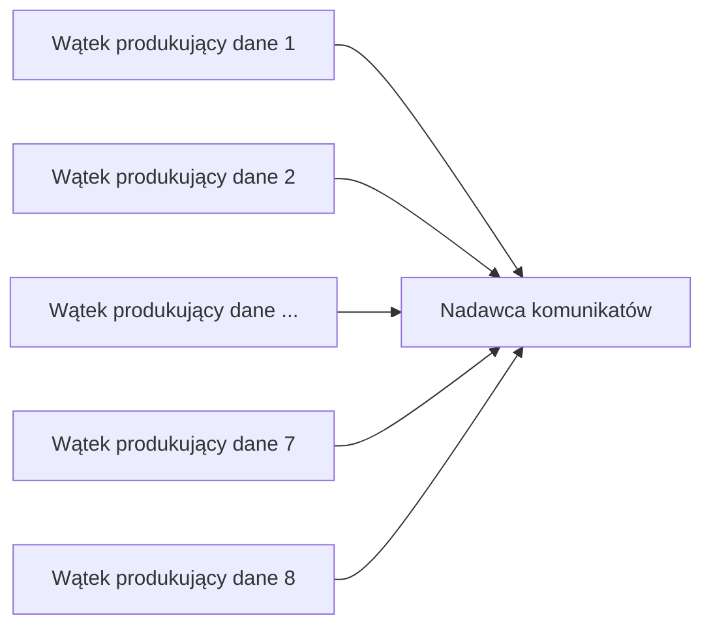
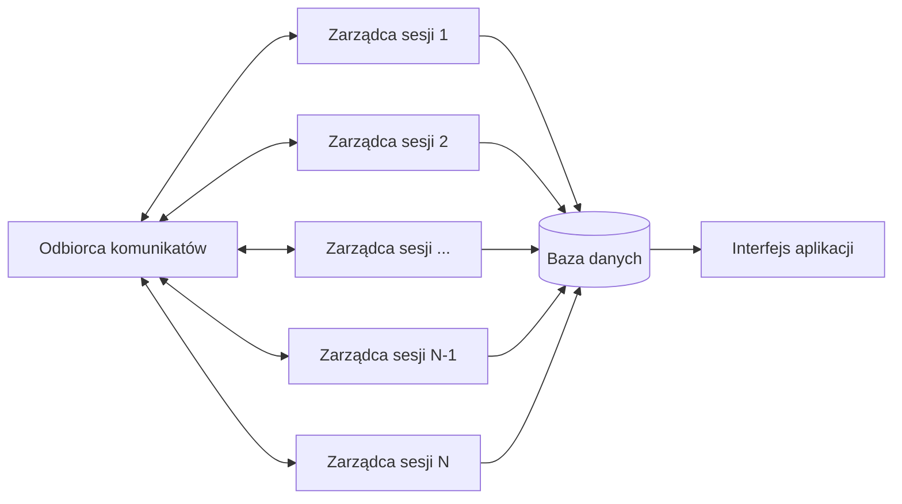
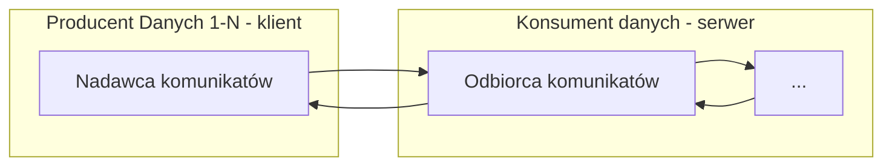
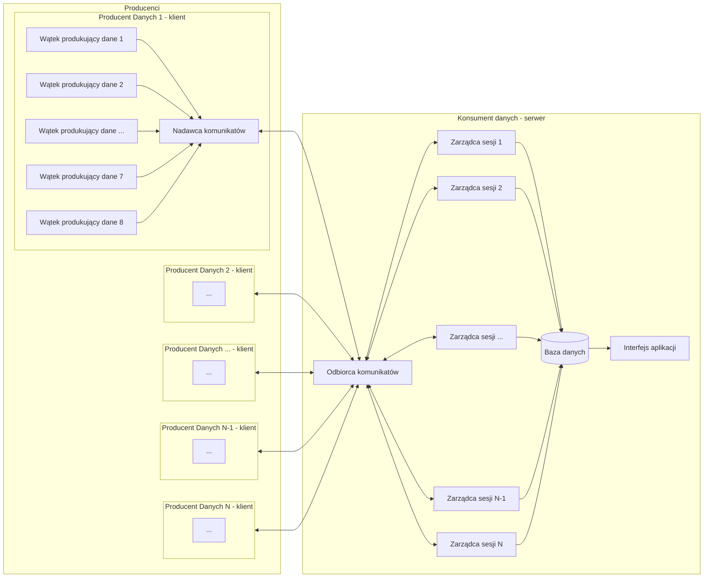

<!-- # Mail od Wytrębowicza

- Korzystajcie z jednego portu max kilku z przedziału 1-1023;

- Przykładami protokołów pozwalających na równoległą transmisję strumieni danych w ramach jednego przepływu TCP lub UDP są: XMPP, WebSocket, QUIC. 

- Nie korzystać z nazwy fragment jeśli chodzi o wydzieloną część pliku xD
- poprawnie korzystać z nazwy serwer iteracyjny i współbieżny

- Zasugerowałem Wam wzorowanie się na TFTP w celu zapewnienia niezawodności. Ku memu zaskoczeniu przyjęliście również model przekazywania pliku, którego koniec rozpoznawany jest niepełną długością datagramu.

Z zaproponowanego tu przypadku użycia wynika, iteracyjny serwer UDP „udźwignie” tę komunikację. Jednak dla każdego sterownika będzie musiał utrzymywać kontekst komunikacji.

Zastosowanie
- system pomiarowy z centralnym serwerem akwizycji danych i dużą liczbą sterowników z sensorami.
- Sterownik może mieć od 1 do 8 sensorów.
- Z każdym sensorem związany jest proces pomiarowy, który co określony interwał (dla danego sensora) przekazuje wartość pomiaru (paczkę danych) do waszego systemu.
- Wartość ta może mieć długość od 1 do 4 bajtów (albo więcej jeślibyśmy chcieli przekazywać współrzędne GPS).
- Interwał może być w zakresie od 0.5s do 30 minut.
- Sterownik stempluje czasem otrzymane pomiary, grupuje je i wysyła datagramem UDP o rozmiarze nie większym  niż 512 bajtów do serwera.
- Można przyjąć, że sterownik wysyła datagram gdy osiągnął on maksymalny rozmiar albo wcześniej – tak aby paczka danych nie czekała na transport dłużej niż określony parametr, np. 10 min.
- Zapewne dla celów debugowania i demonstracji, wymieniane tu czasy należałoby skrócić. 
- Aplikacja akwizycji danych otrzymuje z waszego systemu strumienie paczek (danych pomiarowych) pochodzących od kolejnych sensorów.

Spodziewam się, że w projekcie wstępnym zdefiniowane będą PDUs (Protocol Data Units) oraz SDUs (Service Data Units) dla strony producenta danych (można go nazwać klientem) i konsumenta danych (można go nazwać serwerem).
Przykłady PDU:
- żądanie otwarcia sesji z N strumieniami,
- potwierdzenie otwarcia sesji z N strumieniami,
- zagregowany pakiet danych,
- potwierdzenie pakietu danych,
- żądanie echa,
- echo.

Przykłady SDU dla producenta:
- otwórz sesję komunikacyjną (proces lub wątek zarządzający),
- zamknij sesję komunikacyjną,
- wyślij paczkę danych (proces lub wątek pomiarowy). -->


<!-- Nagłówek – nazwę przedmiotu, nazwę projektu (proszę zaproponować jego nazwę własną), nazwiska autorów, wskazanie lidera, datę sporządzenia. -->

# Programowanie Sieciowe

Zespół Z43:
```s
Mateusz Brzozowski
Bartłomiej Krawczyk
Jakub Marcowski
Aleksandra Sypuła  # lider
```

# System niezawodnego strumieniowania danych po UDP.

<!-- Treść zadania. -->
Zaprojektuj i zaimplementuj protokół warstwy sesji, umożliwiający równoległe przesyłanie do 8 jednokierunkowych strumieni paczek danych stemplowanych czasem. Należy użyć protokołu UDP. Można użyć implementacji protokołu TFTP (Trivial File Transfer Protocol).

<!-- Przyjęte założenia funkcjonalne i niefunkcjonalne. -->

## Założenia funkcjonalne:
- niezawodność <!-- TODO -->
    - wszystkie wysłane dane dotrą w poprawnej formie,
    - jeśli nie zgadza się suma kontrolna serwer prosi o dokonanie retransmisji,
    - serwer potwierdza wszystkie przesyłane datagramy,
    - ograniczamy wielkość datagramów do 512 bajtów, aby uniknąć fragmentacji

- kolejność <!-- TODO -->
    - poszczególne pomiary są stemplowane czasem podczas wstawiania do nadawcy

- serwer iteracyjny <!-- TODO -->
    - serwer odbiera pakiety, obsługuje pakiet w ramach sesji, odsyła odpowiednią odpowiedź i wraca do nasłuchiwania na gnieździe
    - poszczególny strumień danych będzie rozpoznawany poprzez adres wysyłającego, port wysyłającego, adres odbierającego oraz port odbierającego (protokół narzucony z zadania - UDP)

- bezpieczeństwo
    - w fazie nawiązywania połączenia uzgadniany jest klucz asymetryczny do przesyłu klucza symetrycznego
    - przesyłamy klucz symetryczny chroniony jednorazowym kluczem asymetrycznym
    - dane chronione będą kluczem symetrycznym

- obsługiwane typy datagramów: <!-- TODO -->
    - READ REQUEST (RRQ) - zawierający nazwę pliku oraz wskazujący, czy przesyłany jest tekst, czy bity
    - WRITE REQUEST (WRQ)
    - DATA - zawierający 16-bitowy number bloku i do 512 bajtów danych
    - ACK - zawierający 16-bitowy numer bloku
    - ERROR - dla niektórych, wyznaczonych błędów

- kolejne fazy połączenia <!-- TODO -->
    1. 

## Założenia niefunkcjonalne:
- bezpieczeństwo
    - dane są szyfrowane
- dostępność
	- docelowo użytkownik powinien mieć dostęp do usługi 24/7 (bez przerw)
- wydajność
	- wysyłający jest w stanie wysyłać 8 strumieni danych równocześnie

<!-- Podstawowe przypadki użycia. -->

# Przypadki użycia <!-- TODO -->

1. System pomiarowy:
    - System składa się z centralnego serwera akwizycji danych oraz wielu sterowników z sensorami.
    - Każdy sterownik może mieć od jednego do ośmiu sensorów, z których każdy jest związany z procesem pomiaru.
    - Proces pomiaru przesyła do systemu wartość pomiaru (1 - 4 bajty) co określony interwał (0.5s - 30min) (dla danego sensora).
    - Sterownik stempluje czasem otrzymane pomiary, grupuje je i wysyła w formie datagramu UDP o rozmiarze nie większym niż 512 bajtów do serwera.
    - Datagram jest wysyłany, gdy osiągnie maksymalny rozmiar lub wcześniej, aby uniknąć sytuacji, w której paczka danych czekałaby na transport dłużej niż określony parametr (na przykład dziesięć minut).
    - Aplikacja akwizycji danych otrzymuje strumienie paczek (danych pomiarowych) z systemu pochodzących od kolejnych sensorów.
    - Przykład - system monitorowania jakości powietrza:
        - System składa się z centralnego serwera oraz wielu czujników zainstalowanych w różnych lokalizacjach.
        - Czujniki monitorują poziomy różnych zanieczyszczeń w powietrzu, takich jak dwutlenek węgla, tlenki azotu i pyły zawieszone.
        - Każdy czujnik przesyła do systemu wartości pomiarowe co określony interwał (np. co 5 minut, ale na potrzeby prezentacji czas ten powinien być krótszy).
        - Serwer otrzymuje strumień danych pomiarowych z każdego czujnika i przechowuje je w bazie danych.

<!-- 2. Urządzenie wykonujące pomiary
    - wysyłający działa na urządzeniu agregującym dane z wielu urządzeń pomiarowych
    - każde urządzenie pomiarowe co pewien okres generuje podobną ilość danych - plik na przykład ok. 200kB
    - wysyłający przesyła równolegle do 8 takich pomiarów na raz
    - wysyłający przesyła dane do jednego określonego odbierającego
    - pomiary są sukcesywnie dodawane do kolejki do wysłania
    - należy pomiary podzielić na do 8 kanałów i wysyłać równolegle - jeden pomiar przez jeden kanał

3. Przesyłanie zbioru plików na inną maszynę
    - każdy plik traktujemy jako oddzielny strumień danych do przesłania
    - wysyłamy równocześnie 8 plików -->

<!-- Analiza możliwych sytuacji błędnych i proponowana ich obsługa. -->

# Możliwe sytuacje błędne <!-- TODO -->

Sytuacje błędne w fazie nawiązywania połączenia:
- duplikacja pakietu nawiązującego połączenie od wysyłającego
    - odbierający odpowiada na każdy pakiet inicjujący połączenie - przydzielenie nowego gniazda 
    - wysyłający skorzysta jedynie z pierwszego wysłanego gniazda przez odbierającego
    - drugie gniazdo odbierającego po pewnym czasie zostanie zamknięte przez timeout
- zgubienie datagramu od odbierającego
    - retransmisja pakietu (po czasie retry)
    - zakończenie transmisji (po czasie timeout) i zamknięcie otwartego gniazda
- niewystarczająca ilość zasobów odbierającego
    - przesłanie datagramu z kodem błędu
- datagram zmodyfikowany w czasie przesyłu
    - przesyła datagram z kodem błędu (incorrectly formed packet)
- odbiór pakietu oznaczonego jako błąd (inny niż incorrectly formed packet)
    - terminujemy połączenie
    - wysyłający w takiej sytuacji będzie próbował nawiązać nowe połączenie i wysłać dane na nowo
    - pamiętamy cały strumień danych dopóki nie zostanie wysłany
- odbiór pakietu oznaczonego jako incorrectly formed packet
    - natychmiastowa retransmisja pakietu

Sytuacje błędne w czasie deszyfrowania datagramu:
- niezgodne nagłówki - np. nie istniejąca operacja
    - odrzucenie pakietu - odesłanie datagramu z kodem błędu (incorrectly formed packet)

Sytuacje błędne w fazie przesyłu danych:
- datagram zmodyfikowany w czasie przesyłu
    - nie zgadza się suma kontrolna
    - odbierający przesyła datagram z kodem błędu (incorrectly formed packet)
    - wysyłający na ponownie przesyła datagram
- fragmentacja datagramu
    - nie powinna wystąpić - ograniczamy się do 512B na datagram
- duplikacja datagramu
    - każdy datagram w ramach przesyłu danych zawierać będzie numer kolejny - ignorujemy numery które są różne od oczekiwanych
    - każdy datagram z potwierdzeniem zawierać będzie numer kolejny - wysyłający ignoruje potwierdzenia zduplikowane
- zgubienie datagramu w sieci
    - retransmisja datagramu (z danymi / z potwierdzeniem) w przypadku nie otrzymania datagramu przez pewien okres (retry)
    - w tym celu pamiętamy ostatni wysłany datagram - aby móc przesłać go ponownie
    - transmisję kończymy dopiero gdy otrzymany datagram mniejszy niż 512B
- odbiór pakietu oznaczonego jako błąd (inny niż incorrectly formed packet)
    - terminujemy połączenie
    - wysyłający w takiej sytuacji będzie próbował nawiązać nowe połączenie i wysłać dane na nowo
    - pamiętamy cały strumień danych dopóki nie zostanie wysłany
- odbiór pakietu oznaczonego jako incorrectly formed packet
    - natychmiastowa retransmisja pakietu
- przedwczesne zakończenie połączenia bez odebrania pakietu z błędem
    - jeśli przez pewien okres (wielokrotność retry - timeout) nie otrzymamy odpowiedzi następuje zakończenie połączenia i uznanie, że wystąpił błąd połączenia
- skończył się zasób po stronie odbierającego (pamięć)
    - wysyłamy pakiet z kodem błędu
 
Sytuacje błędne w fazie negocjacji klucza symetrycznego:
- analogicznie do fazy z przesyłem danych
 
<!-- Wybrane środowisko sprzętowo-programowe (systemy operacyjne, biblioteki programistyczne) i narzędziowe (debugowanie, testowanie). -->

# Środowisko sprzętowo-programowe

### System operacyjny
Planujemy napisać implementację wymyślonego protokołu działającą w środowisku dockera w systemie Linux.

### Środowisko programowe
Implementację protokołu napiszemy w języku python.

Skorzystamy z dostępnych bibliotek:
- socket - do obsługi gniazd
- threading - biblioteka wspierająca wątki
- asyncio - do obsługi czytania dzielonego zasobu przez kilka wątków

Testy integracyjne oraz jednostkowe postaramy się napisać z wykorzystaniem biblioteki pytest.

Testy manualne będziemy wykonywać korzystając z porozumiewających się kontenerów - podobnie jak testowaliśmy zadania z laboratorium.

<!-- Architekturę rozwiązania, tj. ilustrację i opis struktury logicznej systemu (koncepcyjnych bloków funkcjonalnych). Przykładowo oprogramowanie węzła komunikacyjnego można zdekomponować na następujące bloki:
- Odbiorca i parser komunikatów, analizujący ich poprawność składniową, sensowność w danym kontekście, wykrywający potencjalne złośliwe komunikaty. 
- Nadawca komunikatów, sprawdzający poprawność danych otrzymanych do wysłania, obsługujący błędy wysyłania.
- Zarządca sesji lub połączenia. Ten blok nie zawsze jest potrzebny.
- Rejestrator danych albo zarządca pamięci. Może to być obsługa lokalnej bazy danych.
- Interfejs do lokalnej aplikacji na rzecz której prowadzona jest komunikacja. 
- Obsługa dziennika zdarzeń.
- Tester. Moduł działający w tle lub na żądanie sprawdzający spójność przechowywanych danych, poprawność logiczną wykonywanych operacji.
-->

# Architektura Rozwiązania

### Producent danych


### Konsument danych


### Komunikacja



### Złożenie w całość



**Wątek produkujący dane:**
- generuje co pewien okres dane niewielkich rozmiarów
- przekazuje dane do nadawcy komunikatów
- dane generowane przez wątek są traktowane jako jeden strumień danych
- może się znaleźć do 8 takich wątków w jednej sesji

**Nadawca komunikatów:**
- inicjuje sesję z serwerem
- negocjuje klucz sesyjny z serwerem
- buforuje otrzymywane dane do osiągnięcia limitu wielkości wysyłanego pakietu - 512 B
- zapisuje pochodzenie danych z poszczególnych wątków
- zapisuje czas otrzymania danych ze strumienia
- szyfruje dane ustalonym kluczem sesyjnym (najpierw dopełniając dane randomowym paddingiem do 512B)
- działa w trybie prześlij pakiet i czekaj na odpowiedź (z ustawionym timeout)
    - po czasie bez odpowiedzi - retransmituje ponownie pakiet
    - gdy kilka razy będzie następowała retransmisja i dalej nie otrzyma odpowiedzi - kończy połączenie

**Odbiorca komunikatów:**
- odbiera poszczególne komunikaty
- sprawdza czy dane z nagłówka są poprawne
- rozpoznaje numer sesji na podstawie nagłówka
    - w przypadku nieznanego numeru sesji tworzy nowego zarządce sesji
- przekazuje pakiet do obsługi przez odpowiedniego zarządcę sesji
- przekazuje komunikaty wygenerowane przez zarządcę sesji do odpowiedniego klienta

**Zarządca sesji:**
- przechowuje informacje o aktywnej sesji
- zachowuje informacje o stanie danego połączenia np.
    - adres IP oraz port klienta
    - id sesji
    - fazie sesji (nawiązywanie połączenia, uzgadnianie klucza, przesyłanie danych)
    - ustalony klucz sesyjny
    - ilość strumieni danych
- obsługuje otrzymywane pakiety
- uzgadnia klucz sesyjny
- deszyfruje pakiety
- decyduje czy dany pakiet ma sens w kontekście danej sesji
- przygotowuje komunikaty (odpowiedzi) do przesłania do klienta
    - przekazuje je odbiorcy do wysłania
    - potwierdza wszystkie otrzymane poprawne pakiety
- rozdziela poszczególne strumienie danych do odpowiednich miejsc w bazie danych

**Baza danych:**
- przechowuje uszeregowane dane według poszczególnych strumieni danych
- agreguje wszystkie otrzymywane dane

**Interfejs aplikacji:**
- może działać na oddzielnym wątku od pozostałych komponentów
- aplikacja monitorująca
- wyświetla aktualny stan bazy danych w postaci wykresów


## Protocol and Service Data Units <!-- TODO -->

### PDU dla klienta (producenta danych)
- uzgodnienie klucza symetrycznego:
    - przykłady
- żadanie otwarcia sesji z N strumieniami:
    - przykłady
- przesyłana paczka danych:
    - przykłady
- zamknięcie sesji:
    - przykłady

### PDU dla serwera (konsumenta danych)
- uzgodnienie klucza symetrycznego:
    - przykłady
- potwierdzenie otwarcia sesji z N strumieniami:
    - przykłady
- potwierdzenie odbioru paczki danych:
    - przykłady
- zamknięcie sesji:
    - przykłady

### SDU dla klienta (producenta danych)
- nazwiąż połączenie
- uzgodnij klucze symetryczne w ramach bezpiecznego połączenia
- wyślij paczkę danych
- odbierz potwierdzenie przyjęcia danych przez konsumenta
- zamknij sesję komunikacyjną

### SDU dla serwera (konsumenta danych)
- przydziel numer portu klientowi
- uzgodnij klucze symetryczne
- odbierz paczkę danych
- wyślij potwierdzenie odebrania paczki danych
- zamknij sesję komunikacyjną

<!-- Ewentualnie API modułów stanowiących główne bloki funkcjonalne.-->

## Wstępne API modułów stanowiących główne bloki funkcjonalne

```py
import queue
from typing import Mapping, Tuple
from random import randint


class Coordinates:
    latitude: float
    longitude: float


class Data:
    data_stream_id: int
    time: timestamp
    content: bytes
    coordinates: Coordinates


class Sender:
    buffer: queue[Data]
    session_key: str
    public_key: str
    private_key: str
    receiver_public_key: str

    def __init__(self, address: Tuple[str, int]) -> None: pass

    def send(self, content: bytes, stream_id: int) -> None: pass


class Database:
    data: Mapping

    def insert(self, data: Data, address: Tuple[str, int]) -> None: pass


class Packet:
    content: bytes
    # based on final implementation this might be just bytes
    # with special functions to convert it to more headers and data
    # or
    # it might be parsed to/from bytes to headers and data inside a constructor

    def get_session_id(self) -> int: pass


class SessionManager:
    session_id: int
    session_key: str
    public_key: str
    private_key: str
    sender_public_key: str
    database: Database

    def handle(self, packet: Packet) -> Packet: pass


class Receiver:
    session_managers: Mapping[int, SessionManager] = {}

    def _handle(self, packet: Packet) -> Packet:
        session_id = packet.get_session_id()
        if (session_id not in session_managers):
            session_id = randint(1, MAX_SESSION_NUMBER)
            session_managers[session_id].append(SessionManager())

        result = session_managers[session_id].handle(packet)

        if (not result):
            session_managers.pop(session_id)

        return result


class Interface:
    database: Database

    def _update_view(self) -> None: pass
```

<!-- Sposób testowania. -->

# Sposób testowania

- manualny
	- w oddzielnych kontenerach odpalamy dwa programy - jeden wysyłający dane z wykorzystaniem protokołu i drugi odbierający dane i wyświetlający wysyłane dane na standardowym wyjściu - sprawdzamy czy dane się zgadzają
- jednostkowy
    - można przygotować przykładowy program (np. fibonacci), który korzysta jednocześnie z wysyłania oraz odbierania (na dwóch różnych wątkach), wysyłane są kolejne wartości ciągu i sprawdzamy, czy odbierający zwraca poprawnie wynik

<!-- Podział prac w zespole. -->

# Podział prac <!-- TODO -->

- Mateusz Brzozowski:
	- implementacja wysyłającego (Sender)
	- szyfrowanie / deszyfrowanie danych
- Bartłomiej Krawczyk:
	- implementacja odbierającego (Receiver)
	- uzgodnienie klucza sesyjnego
- Jakub Marcowski:
	- implementacja zarządcy sesji (SessionManager)
- Aleksandra Sypuła:
	- generowanie kluczy (2x publiczny, 2x prywatny, 1x symetryczny)
	- aplikacja lokalna (interfejs)

<!-- Przewidywane funkcje do zademonstrowania w ramach odbioru częściowego. -->

# Funkcje do zademonstrowania w ramach odbioru częściowego
- bezstratny przesył danych
- równoległy przesył danych
- na etap odbioru częściowego bez zapewnienia bezpieczeństwa
