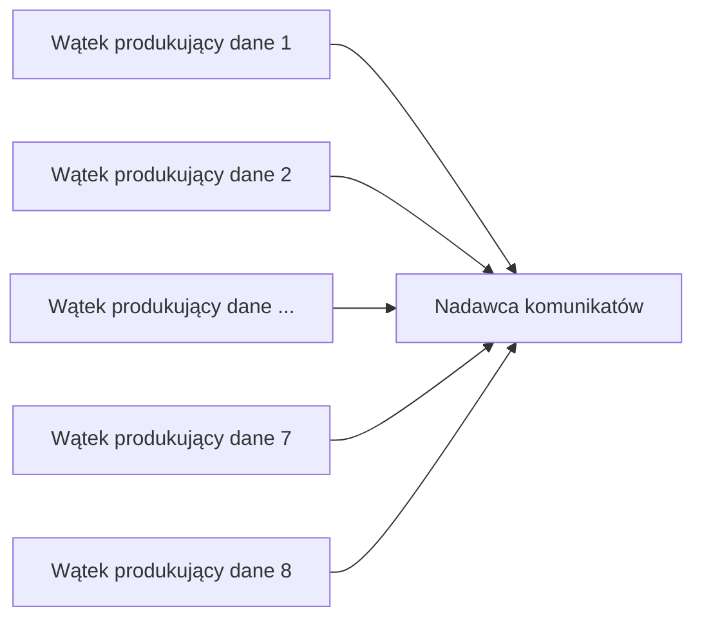
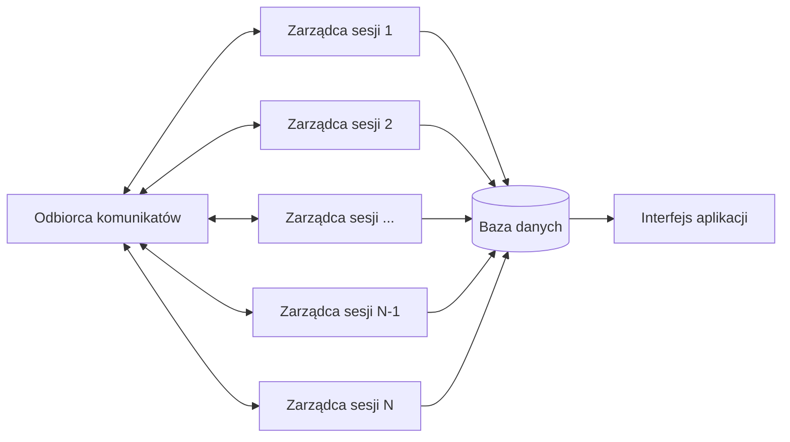
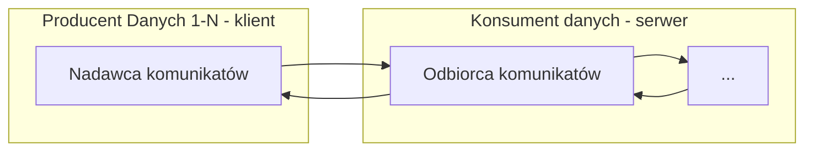
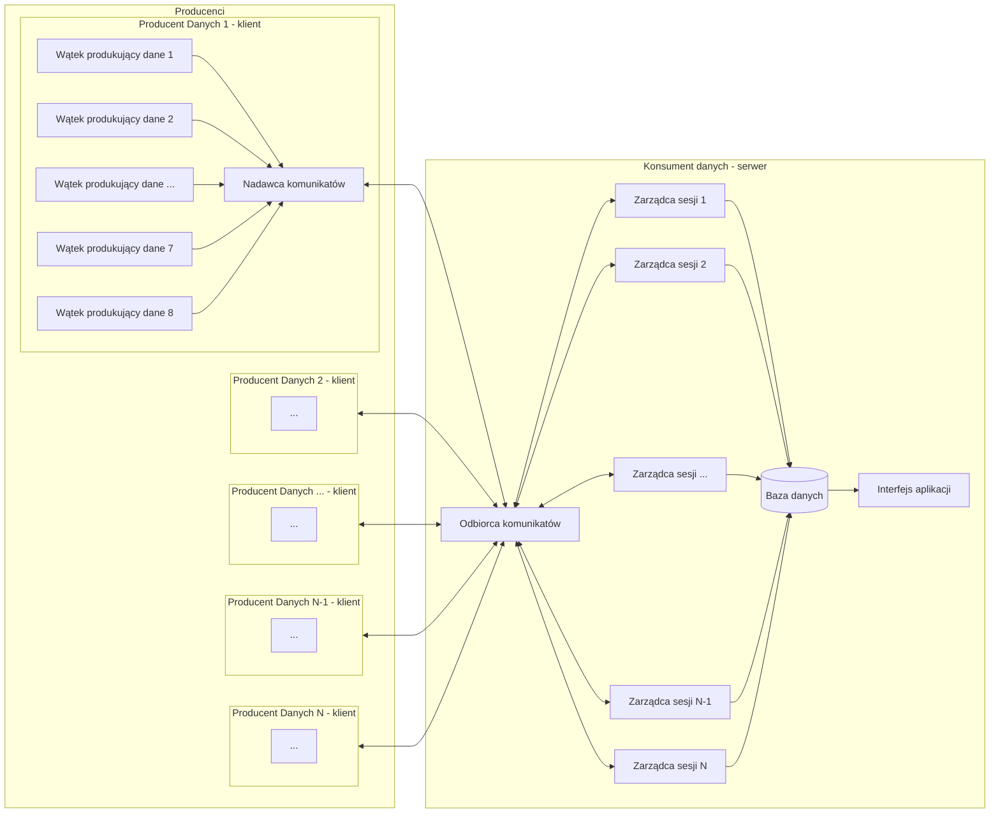

<!-- Nagłówek – nazwę przedmiotu, nazwę projektu (proszę zaproponować jego nazwę własną), nazwiska autorów, wskazanie lidera, datę sporządzenia. -->

# Programowanie Sieciowe

Zespół Z43:
```s
Mateusz Brzozowski
Bartłomiej Krawczyk
Jakub Marcowski
Aleksandra Sypuła  # lider
```

# System niezawodnego strumieniowania danych po UDP.

<!-- Treść zadania. -->
Zaprojektuj i zaimplementuj protokół warstwy sesji, umożliwiający równoległe przesyłanie do 8 jednokierunkowych strumieni paczek danych stemplowanych czasem. Należy użyć protokołu UDP. Można użyć implementacji protokołu TFTP (Trivial File Transfer Protocol).

<!-- Przyjęte założenia funkcjonalne i niefunkcjonalne. -->

## Założenia funkcjonalne:
- niezawodność
    - wszystkie wysłane dane dotrą w poprawnej formie,
    - jeśli nie zgadza się suma kontrolna, serwer prosi o dokonanie retransmisji,
    - serwer potwierdza wszystkie przesyłane datagramy,
        - w przypadku, gdy klient nie otrzyma potwierdzenia retransmituje pakiet co pewien okres do skutku lub do upływu czasu terminacji
    - ograniczamy wielkość datagramów do 512 bajtów, aby uniknąć fragmentacji

- kolejność
    - poszczególne pomiary są stemplowane czasem podczas wstawiania do nadawcy
    - na podstawie stempli czasowych baza danych ustawia pakiety w odpowiedniej kolejności

- serwer iteracyjny
    - serwer odbiera pakiety, obsługuje pakiet w ramach sesji, odsyła odpowiednią odpowiedź i wraca do nasłuchiwania na gnieździe
    - poszczególny klient sesji będzie rozpoznawany poprzez adres oraz port

- bezpieczeństwo
    - w fazie nawiązywania połączenia uzgadniany jest klucz asymetryczny do przesyłu klucza symetrycznego
    - przesyłamy klucz symetryczny chroniony jednorazowym kluczem asymetrycznym
    - dane chronione będą kluczem symetrycznym

- kolejne fazy połączenia
    1. Nadawca inicjuje sesję z serwerem
    2. Wymiana kluczy publicznych
    3. Uzgodnienie klucza asymetrycznego (do przesłania klucza sesyjnego)
    4. Przesył klucza symetrycznego (sesyjnego)
    5. Przesył informacji o podłączającym się kliencie (ilość strumieni danych, ich id)
    6. Przesył danych zabezpieczonym kanałem z potwierdzaniem kolejnych pakietów:
        - W przypadku braku otrzymania potwierdzenia odebrania pakietu przez klienta następuje retransmisja - jeżeli po jej kilku próbach wciąż brak odpowiedzi ze strony serwera - następuje koniec transmisji
    7. Zakończenie sesji

## Założenia niefunkcjonalne:
- bezpieczeństwo
    - dane są szyfrowane
- dostępność
	- docelowo użytkownik powinien mieć dostęp do usługi 24/7 (bez przerw)
- wydajność
	- wysyłający jest w stanie wysyłać 8 strumieni danych równocześnie

<!-- Podstawowe przypadki użycia. -->

# Przypadki użycia

System pomiarowy:
- System składa się z centralnego serwera akwizycji danych oraz wielu sterowników z sensorami.
- Każdy sterownik może mieć od jednego do ośmiu sensorów, z których każdy jest związany z procesem pomiaru.
- Proces pomiaru przesyła do systemu wartość pomiaru (1 - 4 bajty) co określony interwał (0.5s - 30min) (dla danego sensora).
- Sterownik stempluje czasem otrzymane pomiary, grupuje je i wysyła w formie datagramu UDP o rozmiarze nie większym niż 512 bajtów do serwera.
- Datagram jest wysyłany, gdy osiągnie maksymalny rozmiar lub wcześniej, aby uniknąć sytuacji, w której paczka danych czekałaby na transport dłużej niż określony parametr (na przykład dziesięć minut).
- Aplikacja akwizycji danych otrzymuje strumienie paczek (danych pomiarowych) z systemu pochodzących od kolejnych sensorów.
- Przykład 1: system monitorowania jakości powietrza:
    - System składa się z centralnego serwera oraz wielu czujników zainstalowanych w różnych lokalizacjach.
    - Czujniki monitorują poziomy różnych zanieczyszczeń w powietrzu, takich jak dwutlenek węgla, tlenki azotu i pyły zawieszone.
    - Każdy czujnik przesyła do systemu wartości pomiarowe co określony interwał (np. co 5 minut, ale na potrzeby prezentacji czas ten będzie krótszy).
    - Serwer otrzymuje strumień danych pomiarowych z każdego czujnika i przechowuje je w bazie danych.
- Przykład 2: linia produkcyjna świętych mikołaji z czekolady:
    - System składa się z centralnego serwera oraz wielu czujników umieszczonych w poszczególnych maszynach.
    - Czujniki monitorują zawartość poszczególnych parametrów czekolady, takie jak zawartość tłuszczu, kakao, czy temperatura
    - Każdy czujnik co 30 sekund przesyła do systemu zmierzone parametry
    - Server agreguje dane i na bierząco wyświetla wartości poszczególnych parametrach na każdej z maszyn

<!-- Analiza możliwych sytuacji błędnych i proponowana ich obsługa. -->

# Możliwe sytuacje błędne

Sytuacje błędne po stronie klienta:
- duplikacja pakietu w odpowiedzi od serwera
    - odpowiedzi od serwera numerowane tymi samymi numerami co odpowiadający pakiet od klienta
    - jeśli klient otrzyma potwierdzenie sprawdza, czy numer potwierdzenia zgadza się z ostatnio wysłanym numerem datagramu
    - jeśli numery nie zgadzają się ignoruje dane potwierdzenie
- zgubienie odpowiedzi od serwera
    - W przypadku braku otrzymania potwierdzenia odebrania pakietu przez klienta następuje retransmisja
    - jeżeli po jej kilku próbach wciąż brak odpowiedzi ze strony serwera - następuje koniec transmisji
- zmodyfikowany datagram w czasie przesyłu - nie zgadza sie suma kontrolna
    - przesłanie datagramu z kodem błędu (incorrectly formed packet)
- niezgodne nagłówki - np. nie istniejąca operacja
    - przesłanie datagramu z kodem błędu (incorrectly formed packet)
- odbiór pakietu oznaczonego jako błąd (inny niż incorrectly formed packet)
    - koniec transmisji
    - próba nazwiązania nowego połączenia
- odbiór pakietu oznaczonego jako incorrectly formed packet
    - retransmisja ostatniego datagramu
- fragmentacja datagramu
    - nie powinna wystąpić - ograniczamy się do 512B na datagram
- przedwczesne zakończenie połączenia bez odebrania pakietu z błędem
    - próba retransmisji ostatniego datagramu, a po kilku nieudanych próbach zakończenie transmisji

Sytuacje błędne po stronie serwera:
- duplikacja pakietu od klienta
    - klient numeruje kolejne datagramy z danymi (w czasie retransmisji przez klienta ten numer pozostaje taki sam)
    - serwer pamięta jaki numer datagramu otrzymał ostatnio
- zgubienie datagramu od klienta
    - serwer ignoruje taką sytuację (zakładamy, że klient nie otrzyma potwierdzenia i prześle ponownie datagram za jakiś czas)
- zmodyfikowany datagram w czasie przesyłu - nie zgadza sie suma kontrolna
    - przesłanie datagramu z kodem błędu (incorrectly formed packet)
- odbiór pakietu oznaczonego jako błąd (inny niż incorrectly formed packet)
    - zakończenie transmisji
- odbiór pakietu oznaczonego jako incorrectly formed packet
    - retransmisja ostatnio wysłanego datagramu
- otrzymany pakiet o operacji w innej fazie sesji, niż ta w której teraz się znajduje sesja
    - przesłanie datagramu z kodem błędu (wrong operation)
    - zakończenie połączenia
- niezgodne nagłówki - np. nie istniejąca operacja
    - przesłanie datagramu z kodem błędu (incorrectly formed packet)
- niewystarczająca ilość zasobów
    - przesłanie datagramu z kodem błędu (out of resources)
- fragmentacja datagramu
    - nie powinna wystąpić - ograniczamy się do 512B na datagram
- przedwczesne zakończenie połączenia bez odebrania pakietu z błędem
    - zachowujemy informacje o otwartej sesji, a gdy znów będzie chciał klient otworzyć nową sesję to w odpowiedzi serwer prześle kod błędu (wrong operation) zakończy stare połączenie i klient zainicjuje połączenie na nowo

<!-- Wybrane środowisko sprzętowo-programowe (systemy operacyjne, biblioteki programistyczne) i narzędziowe (debugowanie, testowanie). -->

# Środowisko sprzętowo-programowe

### System operacyjny
Planujemy napisać implementację wymyślonego protokołu działającą w środowisku dockera w systemie Linux.

### Środowisko programowe
Implementację protokołu napiszemy w języku python.

Skorzystamy z dostępnych bibliotek:
- socket - do obsługi gniazd
- threading - biblioteka wspierająca wątki
- asyncio - do obsługi czytania dzielonego zasobu przez kilka wątków
- cryptography - do wygenerowania podpisu cyfrowego dla przesyłanego pakietu danych
- typing + mypy - do dodawania i sprawdzania podpowiedzi typów

Testy integracyjne oraz jednostkowe postaramy się napisać z wykorzystaniem biblioteki pytest.

Testy manualne będziemy wykonywać korzystając z porozumiewających się kontenerów - podobnie jak testowaliśmy zadania z laboratorium.

<!-- Architekturę rozwiązania, tj. ilustrację i opis struktury logicznej systemu (koncepcyjnych bloków funkcjonalnych). Przykładowo oprogramowanie węzła komunikacyjnego można zdekomponować na następujące bloki:
- Odbiorca i parser komunikatów, analizujący ich poprawność składniową, sensowność w danym kontekście, wykrywający potencjalne złośliwe komunikaty.
- Nadawca komunikatów, sprawdzający poprawność danych otrzymanych do wysłania, obsługujący błędy wysyłania.
- Zarządca sesji lub połączenia. Ten blok nie zawsze jest potrzebny.
- Rejestrator danych albo zarządca pamięci. Może to być obsługa lokalnej bazy danych.
- Interfejs do lokalnej aplikacji na rzecz której prowadzona jest komunikacja.
- Obsługa dziennika zdarzeń.
- Tester. Moduł działający w tle lub na żądanie sprawdzający spójność przechowywanych danych, poprawność logiczną wykonywanych operacji.
-->

# Architektura Rozwiązania

### Producent danych


### Konsument danych


### Komunikacja



### Złożenie w całość



**Wątek produkujący dane:**
- generuje co pewien okres dane niewielkich rozmiarów
- przekazuje dane do nadawcy komunikatów
- dane generowane przez wątek są traktowane jako jeden strumień danych
- może się znaleźć do 8 takich wątków w jednej sesji

**Nadawca komunikatów:**
- inicjuje sesję z serwerem
- negocjuje klucz sesyjny z serwerem
- buforuje otrzymywane dane do osiągnięcia limitu wielkości wysyłanego pakietu - 512 B
- zapisuje pochodzenie danych z poszczególnych wątków
- zapisuje czas otrzymania danych ze strumienia
- szyfruje dane ustalonym kluczem sesyjnym
- działa w trybie prześlij pakiet i czekaj na odpowiedź (z ustawionym timeout)
    - po czasie bez odpowiedzi - retransmituje ponownie pakiet
    - gdy kilka razy będzie następowała retransmisja i dalej nie otrzyma odpowiedzi - kończy połączenie

**Odbiorca komunikatów:**
- odbiera poszczególne komunikaty
- rozpoznaje sesję na podstawie adresu IP oraz portu nadawcy
    - w przypadku nieznanego adresu oraz portu tworzy nowego zarządcę sesji
- przekazuje pakiet do obsługi przez odpowiedniego zarządcę sesji
- przekazuje komunikaty wygenerowane przez zarządcę sesji do odpowiedniego klienta

**Zarządca sesji:**
- przechowuje informacje o aktywnej sesji
- zachowuje informacje o stanie danego połączenia np.
    - adres IP oraz port klienta
    - id sesji
    - fazie sesji (nawiązywanie połączenia, uzgadnianie klucza, przesyłanie danych)
    - ustalony klucz sesyjny
    - ilość strumieni danych
    - informacja o strumieniach danych
- obsługuje otrzymywane pakiety
- uzgadnia klucz sesyjny
- deszyfruje pakiety
- decyduje czy dany pakiet ma sens w kontekście danej sesji
- przygotowuje komunikaty (odpowiedzi) do przesłania do klienta
    - przekazuje je odbiorcy do wysłania
    - potwierdza wszystkie otrzymane poprawne pakiety
- rozdziela poszczególne strumienie danych do odpowiednich miejsc w bazie danych

**Baza danych:**
- przechowuje uszeregowane dane według poszczególnych strumieni danych
- agreguje wszystkie otrzymywane dane

**Interfejs aplikacji:**
- może działać na oddzielnym wątku od pozostałych komponentów
- aplikacja monitorująca
- wyświetla aktualny stan bazy danych w postaci wykresów


## Protocol and Service Data Units


### PDU dla klienta (producenta danych)
<!-- https://en.wikipedia.org/wiki/Diffie%E2%80%93Hellman_key_exchange -->
- żądanie otwarcia sesji

    | Liczba Bajtów |       Przechowują        |
    |:-------------:|:------------------------:|
    |      1        |           typ            |

- uzgodnienie klucza symetrycznego

    | Liczba Bajtów |            Przechowują             |
    |:------------:|:----------------------------------:|
    |      1       |                typ                 |
    |      8      |   klucz publiczny servera ( A )    |
    |      4      | public (primitive root) base ( g ) |
    |      4      |    public (prime) modulus ( p )    |

**Uwaga:** całe pakiety od tego momentu są szyfrowane kluczem sesyjnym

- deklaracja N strumieni i informacji o nich

    | Liczba Bajtów |       Przechowują        |
    |:------------:|:------------------------:|
    |      1       |           typ            |
    |      1       |     liczba strumieni     |
    |     16      |     id strumienia 1      |
    |     16      |    id strumienia ...     |
    |     16      |     id strumienia 8      |

- przesyłana paczka danych

    | Liczba Bajtów |           Przechowują           |
    |:------------:|:-------------------------------:|
    |      1       |               typ               |
    |      2      |  numer przesyłanego datagramu   |
    |      1       | numer strumienia w ramach sesji |
    |      4      |            timestamp            |
    |      4      |              dane               |
    |     ...      |               ...               |
    |      1       | numer strumienia w ramach sesji |
    |      4      |            timestamp            |
    |      4      |              dane               |

- przesłanie kodu błędu

    | Liczba Bajtów |       Przechowują        |
    |:------------:|:------------------------:|
    |      1       |           typ            |

- zamknięcie sesji

    | Liczba Bajtów |       Przechowują        |
    |:------------:|:------------------------:|
    |      1       |           typ            |

### PDU dla serwera (konsumenta danych)
- potwierdzenie otwarcia sesji:

    | Liczba Bajtów |       Przechowują        |
    |:------------:|:------------------------:|
    |      1       |           typ            |

- uzgodnienie klucza symetrycznego:

    | Liczba Bajtów |          Przechowują          |
    |:------------:|:-----------------------------:|
    |      1       |              typ              |
    |      8      | klucz publiczny servera ( B ) |

**Uwaga:** całe pakiety od tego momentu są szyfrowane kluczem sesyjnym

- potwierdzenie odebrania informacji o sesji:

    | Liczba Bajtów |       Przechowują        |
    |:------------:|:------------------------:|
    |      1       |           typ            |

- potwierdzenie odbioru paczki danych:

    | Liczba Bajtów |        Przechowują         |
    |:------------:|:--------------------------:|
    |      1       |            typ             |
    |      2      | numer odebranego datagramu |

- przesłanie kodu błędu

    | Liczba Bajtów |       Przechowują        |
    |:------------:|:------------------------:|
    |      1       |           typ            |

- zamknięcie sesji:

    | Liczba Bajtów |       Przechowują        |
    |:------------:|:------------------------:|
    |      1       |           typ            |

<!-- <style>
.dreamy {
    opacity: 1.0;
    filter: blur(2px) drop-shadow(0px 0px 15px black);
}
</style>

<div class="dreamy">

</div> -->

---

### SDU dla klienta (producenta danych)
- nazwiąż połączenie
- uzgodnij klucz sesyjny (symetryczny) w ramach bezpiecznego połączenia
- prześlij informacje o strumieniach danych
- wyślij paczkę danych
- odbierz potwierdzenie przyjęcia danych przez konsumenta
- zamknij sesję komunikacyjną

### SDU dla serwera (konsumenta danych)
- obsłuż nawiązanie sesji
- uzgodnij klucz sesyjny (symetryczny) w ramach bezpiecznego połączenia
- odbierz informacje o obsługiwanym kliencie
- odbierz paczkę danych
- wyślij potwierdzenie odebrania paczki danych
- zamknij sesję komunikacyjną

<!-- Ewentualnie API modułów stanowiących główne bloki funkcjonalne.-->

## Wstępne API modułów stanowiących główne bloki funkcjonalne

```py
import queue
from typing import Mapping, Tuple
from random import randint


class Coordinates:
    latitude: float
    longitude: float


class Data:
    data_stream_id: int
    time: timestamp
    content: bytes
    coordinates: Coordinates


class Sender:
    buffer: queue[Data]
    public_key: str
    private_key: str
    receiver_public_key: str

    def __init__(self, address: Tuple[str, int]) -> None: pass

    def send(self, content: bytes, stream_id: int) -> None: pass


class Database:
    data: Mapping

    def insert(self, data: Data, address: Tuple[str, int]) -> None: pass


class Packet:
    content: bytes
    # w zależności od ostatecznej implementacji ta klasa może przechowywać:
    # - nie przetworząną odpowiedź
    #     lub
    # - w konstruktorze możemy parsować datagram
    # i przechowywać już przetworzone nagłówki oraz dane


class SessionManager:
    session_id: int
    session_key: str
    public_key: str
    private_key: str
    sender_public_key: str
    database: Database

    def handle(self, packet: Packet) -> Packet: pass


class Receiver:
    session_managers: Mapping[int, SessionManager] = {}

    def _handle(self, packet: Packet) -> Packet:
        # na podstawie adresu IP oraz portu przekaż datagram do odpowiedniego zarządcy seji
        # jeśli nie istnieje sesja rozpoznawana przez
        # dany adres oraz port stwórz nowego zarządcę sesji i przekaż jemu dany datagram
        # w odpowiedni prześlij do nadawcy datagram przygotowany przez zażądcę sesji


class Interface:
    database: Database

    def _update_view(self) -> None: pass
```

<!-- Sposób testowania. -->

# Sposób testowania

- manualny
	- w oddzielnych kontenerach odpalamy dwa programy - jeden wysyłający dane z wykorzystaniem protokołu i drugi odbierający dane i wyświetlający wysyłane dane na standardowym wyjściu - sprawdzamy czy dane się zgadzają
- jednostkowy
    - można przygotować przykładowy program (np. fibonacci), który korzysta jednocześnie z wysyłania oraz odbierania (na dwóch różnych wątkach), wysyłane są kolejne wartości ciągu i sprawdzamy, czy odbierający zwraca poprawnie wynik

<!-- Podział prac w zespole. -->

# Podział prac

- Mateusz Brzozowski:
	- implementacja wysyłającego (Sender)
	- szyfrowanie / deszyfrowanie danych
- Bartłomiej Krawczyk:
	- implementacja odbierającego (Receiver)
	- uzgodnienie klucza sesyjnego
- Jakub Marcowski:
	- implementacja zarządcy sesji (SessionManager)
- Aleksandra Sypuła:
	- generowanie kluczy (2x publiczny, 2x prywatny, 1x symetryczny)
	- aplikacja lokalna (interfejs, baza danych)

<!-- Przewidywane funkcje do zademonstrowania w ramach odbioru częściowego. -->

# Funkcje do zademonstrowania w ramach odbioru częściowego
- bezstratny przesył danych
- równoległy przesył danych
- na etap odbioru częściowego bez zapewnienia bezpieczeństwa
<!-- -  -->
