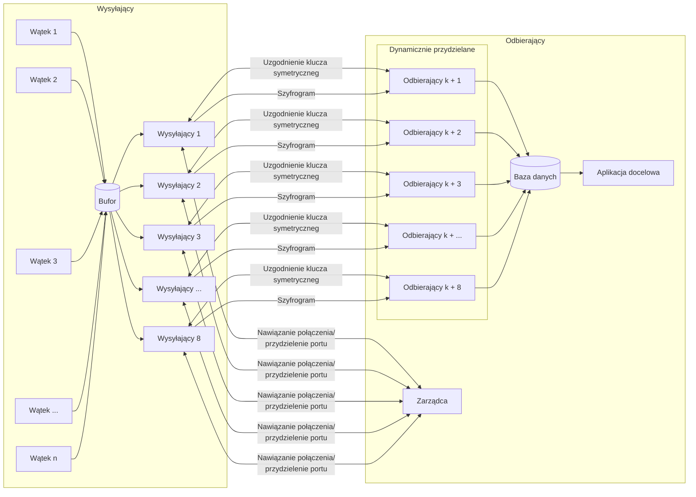

<!-- Nagłówek – nazwę przedmiotu, nazwę projektu (proszę zaproponować jego nazwę własną), nazwiska autorów, wskazanie lidera, datę sporządzenia. -->

# Programowanie Sieciowe

Zespół Z43:
```s
Mateusz Brzozowski
Bartłomiej Krawczyk
Jakub Marcowski
Aleksandra Sypuła  # lider
```

# System niezawodnego strumieniowania danych po UDP.

<!-- Treść zadania. -->
Zaprojektuj i zaimplementuj protokół warstwy sesji, umożliwiający równoległe przesyłanie do 8 jednokierunkowych strumieni paczek danych stemplowanych czasem. Należy użyć protokołu UDP. Można użyć implementacji protokołu TFTP (Trivial File Transfer Protocol).

<!-- Przyjęte założenia funkcjonalne i niefunkcjonalne. -->

## Założenia funkcjonalne:
- niezawodność
    - wszystkie wysłane dane dotrą w poprawnej formie,
    - dokonujemy retransmisji jeśli nie zgadza się suma kontrolna,
    - do każdego datagramu z danymi dodajemy:
    - numer fragmentu
    - sumę kontrolną danych oraz nagłówków
    - potwierdzamy wszystkie przesyłane datagramy
    - ograniczamy wielkość datagramów do 512 bajtów, aby uniknąć fragmentacji
    - w fazie nawiązywania połączenia przesyłamy:
    - znacznik czasu jeden na strumień paczek - będzie to czas wstawienia danych do wysłania
    - wielkość pojedynczego strumienia danych
- kolejność
    - do każdego datagramu z danymi dodajemy:
        - numer fragmentu
        - sumę kontrolną
    - ograniczamy wielkość datagramów do 512 bajtów, aby uniknąć fragmentacji
    - wszystkie dane zostaną przesłane w poprawnej kolejności - w ramach jednego połączenia korzystamy z rozwiązania podobnego do TFTP - kolejne datagramy muszą być potwierdzone zanim zostaną przesłane następne - zachowujemy kolejność
- współbieżność
    - każdy wysyłający może na raz przesyłać do 8 różnych strumieni danych - każdy na inny docelowy port odbierającego
    - poszczególny strumień danych będzie rozpoznawany poprzez adres wysyłającego, port wysyłającego, adres odbierającego oraz port odbierającego (protokół narzucony z zadania - UDP)
    - odbierający ma wydzielony jeden port do odbierania połączeń (serwer iteracyjny) i dla każdego połączenia tworzy nowe gniazdo, aby równolegle obsługiwać połączenia (serwer współbieżny) - przesyła uzgodnione gniazdo do wysyłającego
- bezpieczeństwo
    - w fazie nawiązywania połączenia uzgadniany jest klucz asymetryczny do przesyłu klucza symetrycznego
    - przesyłamy klucz symetryczny chroniony jednorazowym kluczem asymetrycznym
    - dane chronione będą kluczem symetrycznym
    - stemplowanie czasem
    - poszczególne strumienie danych będą stemplowane czasem - informację przesyłamy w fazie nawiązywania połączenia
- obsługiwane typy datagramów:
    - WRITE REQUEST
    - HELLO
    - KEY
    - DATA
    - ACK
    - ERROR
- kolejne fazy połączenia
    1. Wysyłający inicjuje połączenie
    2. Odbierający przydziela nowe gniazdo i odsyła informację do wysyłającego zawierającą gniazdo
    3. Wysyłający inicjuje połączenie na nowe gniazdo
    4. Następuje uzgodnienie klucza symetrycznego (połączenia w jedną i w drugą, aby wymienić się kluczami publicznymi i uzgodnić klucz asymetryczny do przesyłu klucza symetrycznego)
    5. Przesył danych zabezpieczonym kanałem z potwierdzaniem kolejnych pakietów
    6. Koniec transmisji - gdy wysyłający prześle datagram mniejszy niż 512 B

## Założenia niefunkcjonalne:
- bezpieczeństwo
    - dane są szyfrowane
- dostępność
	- docelowo użytkownik powinien mieć dostęp do usługi 24/7 (bez przerw)
- wydajność
	- wysyłający jest w stanie wysyłać 8 strumieni danych równocześnie

<!-- Podstawowe przypadki użycia. -->

# Przypadki użycia

1. Urządzenie wykonujące pomiary
    - wysyłający działa na urządzeniu agregującym dane z wielu urządzeń pomiarowych
    - każde urządzenie pomiarowe co pewien okres generuje podobną ilość danych - plik na przykład ok. 200kB
    - wysyłający przesyła równolegle do 8 takich pomiarów na raz
    - wysyłający przesyła dane do jednego określonego odbierającego
    - pomiary są sukcesywnie dodawane do kolejki do wysłania
    - należy pomiary podzielić na do 8 kanałów i wysyłać równolegle - jeden pomiar przez jeden kanał
    - 
2. Przesyłanie zbioru plików na inną maszynę
    - każdy plik traktujemy jako oddzielny strumień danych do przesłania
    - wysyłamy równocześnie 8 plików

<!-- Analiza możliwych sytuacji błędnych i proponowana ich obsługa. -->

# Możliwe sytuacje błędne

Sytuacje błędne w fazie nawiązywania połączenia:
- duplikacja pakietu nawiązującego połączenie od wysyłającego
    - odbierający odpowiada na każdy pakiet inicjujący połączenie - przydzielenie nowego gniazda 
    - wysyłający skorzysta jedynie z pierwszego wysłanego gniazda przez odbierającego
    - drugie gniazdo odbierającego po pewnym czasie zostanie zamknięte przez timeout
- zgubienie datagramu od odbierającego
    - retransmisja pakietu (po czasie retry)
    - zakończenie transmisji (po czasie timeout) i zamknięcie otwartego gniazda
- niewystarczająca ilość zasobów odbierającego
    - przesłanie datagramu z kodem błędu
- datagram zmodyfikowany w czasie przesyłu
    - przesyła datagram z kodem błędu (incorrectly formed packet)
- odbiór pakietu oznaczonego jako błąd (inny niż incorrectly formed packet)
    - terminujemy połączenie
    - wysyłający w takiej sytuacji będzie próbował nawiązać nowe połączenie i wysłać dane na nowo
    - pamiętamy cały strumień danych dopóki nie zostanie wysłany
- odbiór pakietu oznaczonego jako incorrectly formed packet
    - natychmiastowa retransmisja pakietu

Sytuacje błędne w czasie deszyfrowania datagramu:
- niezgodne nagłówki - np. nie istniejąca operacja
    - odrzucenie pakietu - odesłanie datagramu z kodem błędu (incorrectly formed packet)

Sytuacje błędne w fazie przesyłu danych:
- datagram zmodyfikowany w czasie przesyłu
    - nie zgadza się suma kontrolna
    - odbierający przesyła datagram z kodem błędu (incorrectly formed packet)
    - wysyłający na ponownie przesyła datagram
- fragmentacja datagramu
    - nie powinna wystąpić - ograniczamy się do 512B na datagram
- duplikacja datagramu
    - każdy datagram w ramach przesyłu danych zawierać będzie numer kolejny - ignorujemy numery które są różne od oczekiwanych
    - każdy datagram z potwierdzeniem zawierać będzie numer kolejny - wysyłający ignoruje potwierdzenia zduplikowane
- zgubienie datagramu w sieci
    - retransmisja datagramu (z danymi / z potwierdzeniem) w przypadku nie otrzymania datagramu przez pewien okres (retry)
    - w tym celu pamiętamy ostatni wysłany datagram - aby móc przesłać go ponownie
    - transmisję kończymy dopiero gdy otrzymany datagram mniejszy niż 512B
- odbiór pakietu oznaczonego jako błąd (inny niż incorrectly formed packet)
    - terminujemy połączenie
    - wysyłający w takiej sytuacji będzie próbował nawiązać nowe połączenie i wysłać dane na nowo
    - pamiętamy cały strumień danych dopóki nie zostanie wysłany
- odbiór pakietu oznaczonego jako incorrectly formed packet
    - natychmiastowa retransmisja pakietu
- przedwczesne zakończenie połączenia bez odebrania pakietu z błędem
    - jeśli przez pewien okres (wielokrotność retry - timeout) nie otrzymamy odpowiedzi następuje zakończenie połączenia i uznanie, że wystąpił błąd połączenia
- skończył się zasób po stronie odbierającego (pamięć)
    - wysyłamy pakiet z kodem błędu
 
Sytuacje błędne w fazie negocjacji klucza symetrycznego:
- analogicznie do fazy z przesyłem danych
 
<!-- Wybrane środowisko sprzętowo-programowe (systemy operacyjne, biblioteki programistyczne) i narzędziowe (debugowanie, testowanie). -->

# Środowisko sprzętowo-programowe

### System operacyjny
Planujemy napisać implementację wymyślonego protokołu działającą w środowisku dockera w systemie Linux.

### Środowisko programowe
Implementację protokołu napiszemy w języku python.

Skorzystamy z dostępnych bibliotek:
- socket - do obsługi gniazd
- threading - biblioteka wspierająca wątki
- asyncio - do obsługi czytania dzielonego zasobu przez kilka wątków

Testy integracyjne oraz jednostkowe postaramy się napisać z wykorzystaniem biblioteki pytest.

Testy manualne będziemy wykonywać korzystając z porozumiewających się kontenerów - podobnie jak testowaliśmy zadania z laboratorium.

<!-- Architekturę rozwiązania, tj. ilustrację i opis struktury logicznej systemu (koncepcyjnych bloków funkcjonalnych). Przykładowo oprogramowanie węzła komunikacyjnego można zdekomponować na następujące bloki:
- Odbiorca i parser komunikatów, analizujący ich poprawność składniową, sensowność w danym kontekście, wykrywający potencjalne złośliwe komunikaty. 
- Nadawca komunikatów, sprawdzający poprawność danych otrzymanych do wysłania, obsługujący błędy wysyłania.
- Zarządca sesji lub połączenia. Ten blok nie zawsze jest potrzebny.
- Rejestrator danych albo zarządca pamięci. Może to być obsługa lokalnej bazy danych.
- Interfejs do lokalnej aplikacji na rzecz której prowadzona jest komunikacja. 
- Obsługa dziennika zdarzeń.
- Tester. Moduł działający w tle lub na żądanie sprawdzający spójność przechowywanych danych, poprawność logiczną wykonywanych operacji.
-->

# Architektura Rozwiązania



Każdy z wątków niezależnie generuje dane, które po wytworzeniu są przechowywane w **buforze**. Następnie dane dzielone są na maksymalnie ośmiu **wysyłających**. Każdy z **wysyłających** rozpoczyna od nawiązania połączenia z **zarządcą**.

**Zarządca** przydziela numery portów nowych **odbierających**.

**Wysyłający** po uzgodnieniu z **odbierającym** klucza symetrycznego rozpoczyna przesył danych w pojedynczych datagramach (każdorazowo czekając na otrzymanie potwierdzenia odbioru przed wysłaniem kolejnego datagramu).

**Baza danych** zbiera dane odebrane przez **odbiorców** i przekazuje je dalej do **aplikacji**.

<!-- Ewentualnie API modułów stanowiących główne bloki funkcjonalne.-->

## Wstępne API modułów stanowiących główne bloki funkcjonalne

```py
import queue
from typing import Mapping

class File:
    file_name: str
    content: bytes

class Buffer:
    queue: queue
    def push(file: File) -> None:
        pass

    def pop() -> File:
        pass

class Sender:
    buffer: Buffer
    file: File
    session_key: str
    public_key: str
    private_key: str
    receiver_public_key: str

class Receiver:
    content: bytes
    session_key: str
    public_key: str
    private_key: str
    sender_public_key: str

class Controller:
    def _assign_receiver() -> Receiver:
        pass

class Database:
    data: Mapping

class Interface:
    data_base: Database
```

<!-- Sposób testowania. -->

# Sposób testowania

- manualny
	- w oddzielnych kontenerach odpalamy dwa programy - jeden wysyłający dane z wykorzystaniem protokołu i drugi odbierający dane i wyświetlający wysyłane dane na standardowym wyjściu - sprawdzamy czy dane się zgadzają
- jednostkowy
    - można przygotować przykładowy program (np. fibonacci), który korzysta jednocześnie z wysyłania oraz odbierania (na dwóch różnych wątkach), wysyłane są kolejne wartości ciągu i sprawdzamy, czy odbierający zwraca poprawnie wynik

<!-- Podział prac w zespole. -->

# Podział prac

- Mateusz Brzozowski:
	- implementacja wysyłającego (Sender)
	- szyfrowanie / deszyfrowanie danych
- Bartłomiej Krawczyk:
	- implementacja odbierającego (Receiver)
	- uzgodnienie klucza sesyjnego
- Jakub Marcowski:
	- obsługa bufora z możliwością czytania i pisania przez wiele wątków
	- implementacja kontrolera przydzielającego odbierających (Controller)
- Aleksandra Sypuła:
	- generowanie kluczy (2x publiczny, 2x prywatny, 1x symetryczny)
	- aplikacja lokalna (interfejs)

<!-- Przewidywane funkcje do zademonstrowania w ramach odbioru częściowego. -->

# Funkcje do zademonstrowania w ramach odbioru częściowego
- bezstratny przesył danych
- równoległy przesył danych
- na etap odbioru częściowego bez zapewnienia bezpieczeństwa
