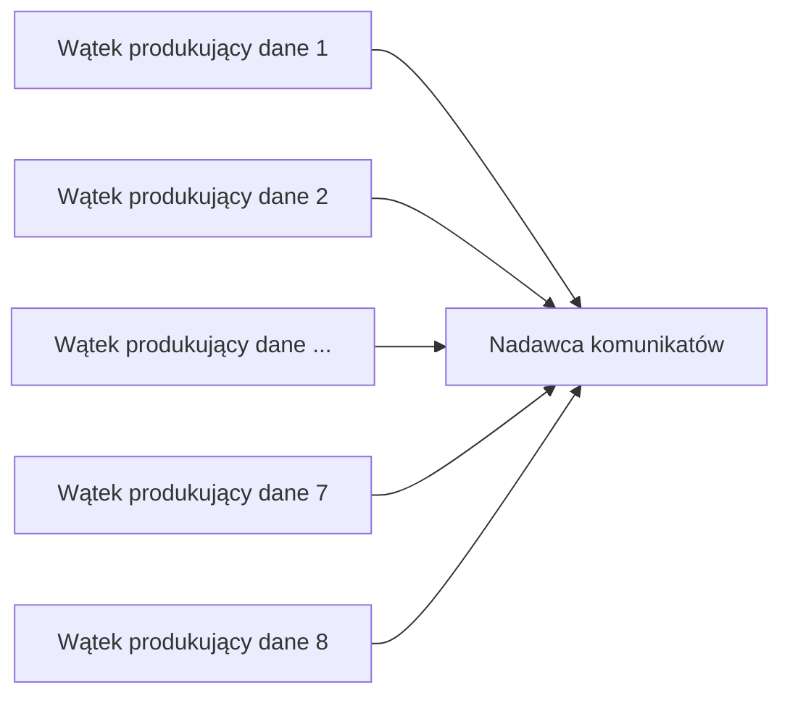
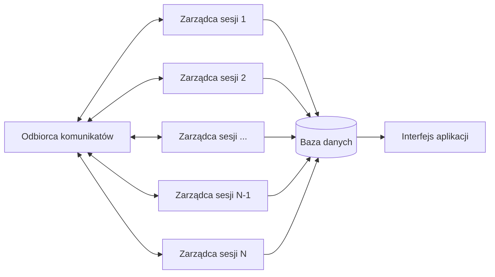
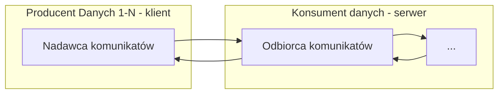
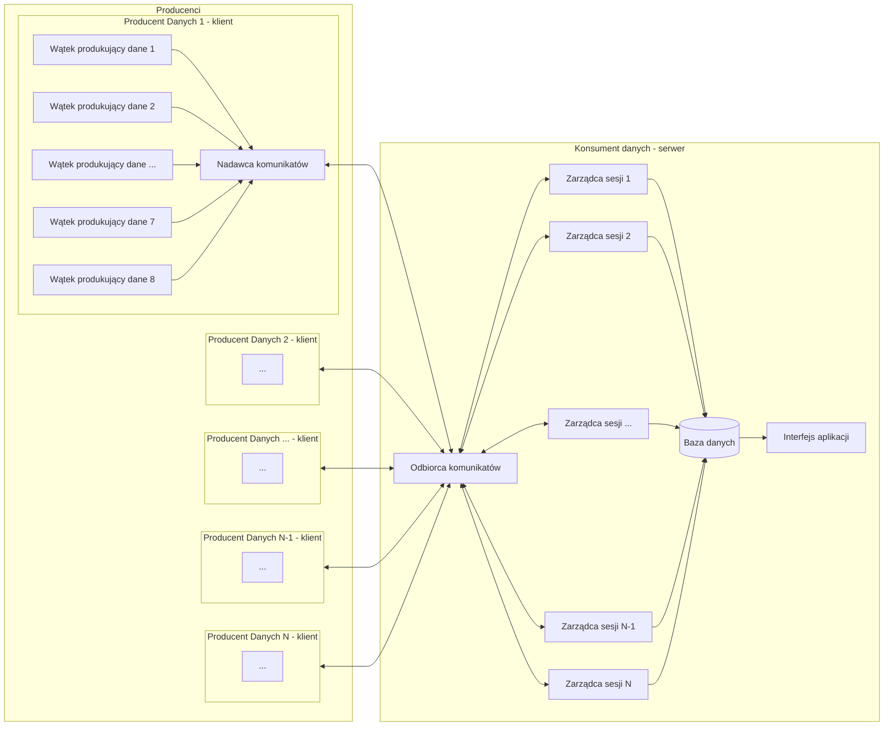
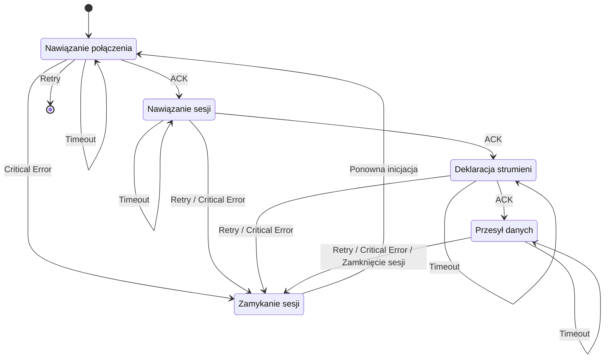
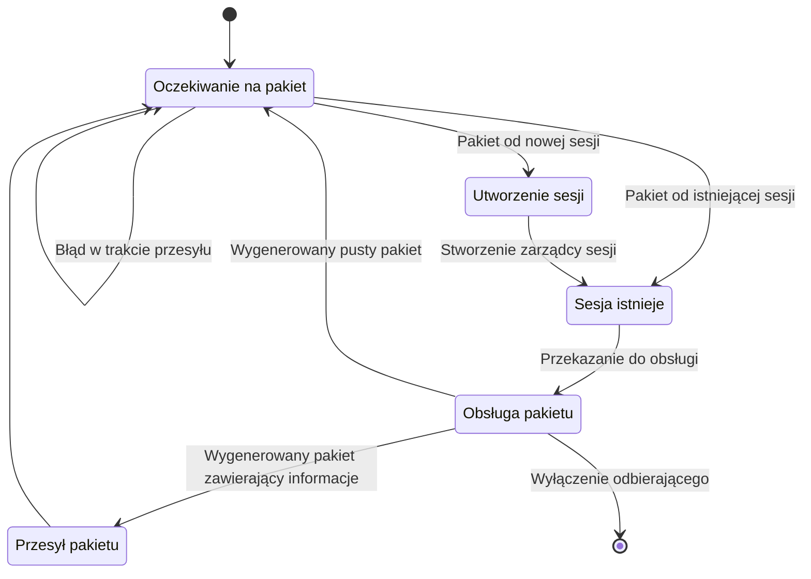
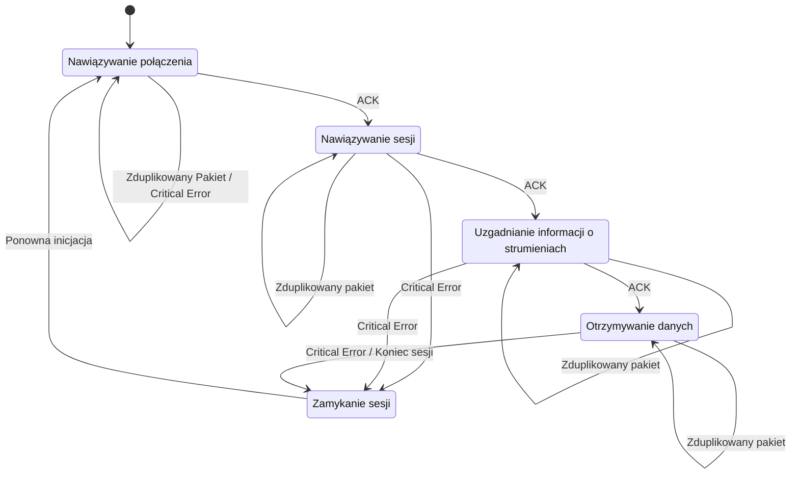

<!-- Nagłówek – nazwę przedmiotu, nazwę projektu (proszę zaproponować jego nazwę własną), nazwiska autorów, wskazanie lidera, datę sporządzenia. -->

# Programowanie Sieciowe

Zespół Z43:
```s
Mateusz Brzozowski
Bartłomiej Krawczyk
Jakub Marcowski
Aleksandra Sypuła  # lider
```

# System niezawodnego strumieniowania danych po UDP.

<!-- Treść zadania. -->
Zaprojektuj i zaimplementuj protokół warstwy sesji, umożliwiający równoległe przesyłanie do 8 jednokierunkowych strumieni paczek danych stemplowanych czasem. Należy użyć protokołu UDP. Można użyć implementacji protokołu TFTP (Trivial File Transfer Protocol).

<!-- Przyjęte założenia funkcjonalne i niefunkcjonalne. -->

## Założenia funkcjonalne:
- niezawodność
    - wszystkie wysłane dane dotrą w poprawnej formie,
    - serwer potwierdza wszystkie przesyłane datagramy,
        - w przypadku, gdy klient nie otrzyma potwierdzenia retransmituje pakiet co pewien okres do skutku lub do upływu czasu terminacji
    - ograniczamy wielkość datagramów do 512 bajtów, aby uniknąć fragmentacji

- kolejność
    - poszczególne pomiary są stemplowane czasem podczas wstawiania do nadawcy
    - na podstawie stempli czasowych baza danych ustawia pakiety w odpowiedniej kolejności

- serwer iteracyjny
    - serwer odbiera pakiety, obsługuje pakiet w ramach sesji, odsyła odpowiednią odpowiedź i wraca do nasłuchiwania na gnieździe
    - poszczególny klient sesji będzie rozpoznawany poprzez adres oraz port

- bezpieczeństwo
    - w fazie nawiązywania połączenia uzgadniany jest klucz sesyjny
    - dane chronione będą kluczem symetrycznym

- kolejne fazy połączenia
    1. Nadawca inicjuje sesję z serwerem
    2. Przesył klucza symetrycznego (sesyjnego) - algorytm Diffiego-Hellmana
    3. Przesył informacji o podłączającym się kliencie (ilość strumieni danych, ich id)
    4. Przesył danych zabezpieczonym kanałem z potwierdzaniem kolejnych pakietów:
        - W przypadku braku otrzymania potwierdzenia odebrania pakietu przez klienta następuje retransmisja - jeżeli po jej kilku próbach wciąż brak odpowiedzi ze strony serwera - następuje koniec transmisji
    5. Zakończenie sesji

## Założenia niefunkcjonalne:
- bezpieczeństwo
    - dane są szyfrowane
- dostępność
	- docelowo użytkownik powinien mieć dostęp do usługi 24/7 (bez przerw)
- wydajność
	- wysyłający jest w stanie wysyłać 8 strumieni danych równocześnie

<!-- Podstawowe przypadki użycia. -->

# Przypadki użycia

System pomiarowy:
- System składa się z centralnego serwera akwizycji danych oraz wielu sterowników z sensorami.
- Każdy sterownik może mieć od jednego do ośmiu sensorów, z których każdy jest związany z procesem pomiaru.
- Proces pomiaru przesyła do systemu wartość pomiaru (1 - 4 bajty) co określony interwał (0.5s - 30min) (dla danego sensora).
- Sterownik stempluje czasem otrzymane pomiary, grupuje je i wysyła w formie datagramu UDP o rozmiarze nie większym niż 512 bajtów do serwera.
- Datagram jest wysyłany, gdy osiągnie maksymalny rozmiar lub wcześniej, aby uniknąć sytuacji, w której paczka danych czekałaby na transport dłużej niż określony parametr (na przykład dziesięć minut).
- Aplikacja akwizycji danych otrzymuje strumienie paczek (danych pomiarowych) z systemu pochodzących od kolejnych sensorów.
- Przykład 1: system monitorowania jakości powietrza:
    - System składa się z centralnego serwera oraz wielu czujników zainstalowanych w różnych lokalizacjach.
    - Czujniki monitorują poziomy różnych zanieczyszczeń w powietrzu, takich jak dwutlenek węgla, tlenki azotu i pyły zawieszone.
    - Każdy czujnik przesyła do systemu wartości pomiarowe co określony interwał (np. co 5 minut, ale na potrzeby prezentacji czas ten będzie krótszy).
    - Serwer otrzymuje strumień danych pomiarowych z każdego czujnika i przechowuje je w bazie danych.
- Przykład 2: linia produkcyjna świętych mikołaji z czekolady:
    - System składa się z centralnego serwera oraz wielu czujników umieszczonych w poszczególnych maszynach.
    - Czujniki monitorują zawartość poszczególnych parametrów czekolady, takie jak zawartość tłuszczu, kakao, czy temperatura
    - Każdy czujnik co 30 sekund przesyła do systemu zmierzone parametry
    - Server agreguje dane i na bierząco wyświetla wartości poszczególnych parametrach na każdej z maszyn

<!-- Analiza możliwych sytuacji błędnych i proponowana ich obsługa. -->

# Możliwe sytuacje błędne

Sytuacje błędne po stronie klienta:
- duplikacja pakietu w odpowiedzi od serwera
    - odpowiedzi od serwera numerowane tymi samymi numerami co odpowiadający pakiet od klienta
    - jeśli klient otrzyma potwierdzenie sprawdza, czy numer potwierdzenia zgadza się z ostatnio wysłanym numerem datagramu
    - jeśli numery nie zgadzają się ignoruje dane potwierdzenie
- zgubienie odpowiedzi od serwera
    - W przypadku braku otrzymania potwierdzenia odebrania pakietu przez klienta następuje retransmisja
    - jeżeli po jej kilku próbach wciąż brak odpowiedzi ze strony serwera - następuje koniec transmisji
- nie istniejąca operacja
    - przejście do zamykania sesji i nawiązanie sesji na nowo
- odbiór pakietu oznaczonego jako błąd
    - koniec transmisji
    - próba nazwiązania nowego połączenia
- fragmentacja datagramu
    - nie powinna wystąpić - ograniczamy się do 512B na datagram
- przedwczesne zakończenie połączenia bez odebrania pakietu z błędem
    - próba retransmisji ostatniego datagramu, a po kilku nieudanych próbach zakończenie transmisji

Sytuacje błędne po stronie serwera:
- duplikacja pakietu od klienta
    - klient numeruje kolejne datagramy z danymi (w czasie retransmisji przez klienta ten numer pozostaje taki sam)
    - serwer pamięta jaki numer datagramu otrzymał ostatnio
    - serwer ignoruje pakiet
- zgubienie datagramu od klienta
    - serwer ignoruje taką sytuację (zakładamy, że klient nie otrzyma potwierdzenia i prześle ponownie datagram za jakiś czas)
- odbiór pakietu oznaczonego jako koniec sesji
    - zakończenie transmisji
- otrzymany pakiet o operacji w innej fazie sesji, niż ta w której teraz się znajduje sesja
    - przesłanie datagramu z kodem błędu (wrong operation)
    - zakończenie połączenia
- niezgodne nagłówki - np. nie istniejąca operacja
    - przesłanie datagramu z kodem błędu (wrong operation)
- niewystarczająca ilość zasobów
    - przesłanie datagramu z kodem błędu (out of resources) <!-- TODO: Is there a out of resources error? -->
- fragmentacja datagramu
    - nie powinna wystąpić - ograniczamy się do 512B na datagram
- przedwczesne zakończenie połączenia bez odebrania pakietu z błędem
    - zachowujemy informacje o otwartej sesji, a gdy znów będzie chciał klient otworzyć nową sesję to w odpowiedzi serwer prześle kod błędu (wrong operation) zakończy stare połączenie i klient zainicjuje połączenie na nowo

# Opis zegarów (timeout)

W projekcie zakładamy timeout jedynie po stronie klienta. Mogą wystąpić dwa rodzaje timeoutów:
- timeout wynikający z socketu - jeśli przez pewien okres (przyjęliśmy 10s) nie powiedzie się wysłanie danych uznajemy, że dany przesył nie powiódł się, po każdym timeout następuje 10 ponownych prób, jeśli te 10 prób też się nie powiedzie to uznajemy, że wysłanie się nie powiodło i sygnalizujemy błąd
- timout na semaforze - ustaliliśmy maksymalny okres co jaki klient powinien wysyłać dane, nawet jeśli bufor się jeszcze nie zapełnił

<!-- Wybrane środowisko sprzętowo-programowe (systemy operacyjne, biblioteki programistyczne) i narzędziowe (debugowanie, testowanie). -->

# Środowisko sprzętowo-programowe

### System operacyjny
Program działa w środowisku dockera w systemie Linux.

### Środowisko programowe
Implementację protokołu napisaliśmy w języku python.

Skorzystaliśmy z dostępnych bibliotek:
- socket - do obsługi gniazd
- threading - biblioteka wspierająca wątki
- asyncio - do obsługi czytania dzielonego zasobu przez kilka wątków
- cryptography - do wygenerowania podpisu cyfrowego dla przesyłanego pakietu danych
- typing + mypy - do dodawania i sprawdzania podpowiedzi typów

Testy integracyjne oraz jednostkowe zostały napisane z wykorzystaniem biblioteki pytest.

<!-- TODO: Napisz testy -->

Testy manualne wykonane zostały korzystając z porozumiewających się kontenerów - podobnie jak testowaliśmy zadania z laboratorium.

<!-- Architekturę rozwiązania, tj. ilustrację i opis struktury logicznej systemu (koncepcyjnych bloków funkcjonalnych). Przykładowo oprogramowanie węzła komunikacyjnego można zdekomponować na następujące bloki:
- Odbiorca i parser komunikatów, analizujący ich poprawność składniową, sensowność w danym kontekście, wykrywający potencjalne złośliwe komunikaty.
- Nadawca komunikatów, sprawdzający poprawność danych otrzymanych do wysłania, obsługujący błędy wysyłania.
- Zarządca sesji lub połączenia. Ten blok nie zawsze jest potrzebny.
- Rejestrator danych albo zarządca pamięci. Może to być obsługa lokalnej bazy danych.
- Interfejs do lokalnej aplikacji na rzecz której prowadzona jest komunikacja.
- Obsługa dziennika zdarzeń.
- Tester. Moduł działający w tle lub na żądanie sprawdzający spójność przechowywanych danych, poprawność logiczną wykonywanych operacji.
-->

# Architektura Rozwiązania

### Producent danych


### Konsument danych


### Komunikacja



### Złożenie w całość


**Wątek produkujący dane:**
- generuje co pewien okres dane niewielkich rozmiarów
- przekazuje dane do nadawcy komunikatów
- dane generowane przez wątek są traktowane jako jeden strumień danych
- może się znaleźć do 8 takich wątków w jednej sesji

**Nadawca komunikatów:**
- inicjuje sesję z serwerem
- negocjuje klucz sesyjny z serwerem
- buforuje otrzymywane dane do osiągnięcia limitu wielkości wysyłanego pakietu - 512 B
- zapisuje pochodzenie danych z poszczególnych wątków
- zapisuje czas otrzymania danych ze strumienia
- szyfruje dane ustalonym kluczem sesyjnym
- działa w trybie prześlij pakiet i czekaj na odpowiedź (z ustawionym timeout)
    - po czasie bez odpowiedzi - retransmituje ponownie pakiet
    - gdy kilka razy będzie następowała retransmisja i dalej nie otrzyma odpowiedzi - kończy połączenie

**Odbiorca komunikatów:**
- odbiera poszczególne komunikaty
- rozpoznaje sesję na podstawie adresu IP oraz portu nadawcy
    - w przypadku nieznanego adresu oraz portu tworzy nowego zarządcę sesji
- przekazuje pakiet do obsługi przez odpowiedniego zarządcę sesji
- przekazuje komunikaty wygenerowane przez zarządcę sesji do odpowiedniego klienta

**Zarządca sesji:**
- przechowuje informacje o aktywnej sesji
- zachowuje informacje o stanie danego połączenia np.
    - adres IP oraz port klienta
    - id sesji
    - fazie sesji (nawiązywanie połączenia, uzgadnianie klucza, przesyłanie danych)
    - ustalony klucz sesyjny
    - ilość strumieni danych
    - informacja o strumieniach danych
- obsługuje otrzymywane pakiety
- uzgadnia klucz sesyjny
- deszyfruje pakiety
- decyduje czy dany pakiet ma sens w kontekście danej sesji
- przygotowuje komunikaty (odpowiedzi) do przesłania do klienta
    - przekazuje je odbiorcy do wysłania
    - potwierdza wszystkie otrzymane poprawne pakiety
- rozdziela poszczególne strumienie danych do odpowiednich miejsc w bazie danych

**Baza danych:**
- przechowuje uszeregowane dane według poszczególnych strumieni danych
- agreguje wszystkie otrzymywane dane

**Interfejs aplikacji:**
- może działać na oddzielnym wątku od pozostałych komponentów
- aplikacja monitorująca
- wyświetla aktualny stan bazy danych w postaci wykresów

### Maszyna stanowa

**Wysyłający:**


Słownik:
- **ACK** - poprawne otrzymanie potwierdzenia od serwera
- **Timeout** - klient wysłał pakiet i minął czas oczekiwania na odpowiedź
- **Retry** - klient wysłał pakiet i kilka razy nie otrzymał odpowiedzi
- **Critical Error** - klient otrzymał od serwera pakiet z błędem


**Odbierający:**


**Zarządca sesji:**



<!-- ## Protocol and Service Data Units -->

## Definicja komunikatów

Typ pakietu jest w formacie - character i w trakcie przesyłu jest zakodowany w `utf-8`.

Id strumienia jest w formacie string i w trakcie przesyłu jest kodowany w `utf-8`.

Wszelkie liczby przesyłamy w postaci bajtów zakodowanych w formacie big-endian. Tak przesyłamy:
- klucze publiczny / bazę / modulus
- liczbę strumieni
- numer datagramu
- numer strumienia
- data jest najpierw konwertowana do liczby całkowitej - ilość sekund od 1970 roku i w ten sposób przesyłana
- dane


### PDU dla klienta (producenta danych)
<!-- https://en.wikipedia.org/wiki/Diffie%E2%80%93Hellman_key_exchange -->
- żądanie otwarcia sesji

    | Liczba Bajtów |       Przechowują        |
    |:-------------:|:------------------------:|
    |      1        |           typ            |

- uzgodnienie klucza symetrycznego

    | Liczba Bajtów |            Przechowują             |
    |:-------------:|:----------------------------------:|
    |      1        |                typ                 |
    |      8        |   klucz publiczny servera ( A )    |
    |      4        | public (primitive root) base ( g ) |
    |      8        |    public (prime) modulus ( p )    |

**Uwaga:** całe pakiety od tego momentu są szyfrowane kluczem sesyjnym

- deklaracja N strumieni i informacji o nich

    | Liczba Bajtów |       Przechowują        |
    |:-------------:|:------------------------:|
    |      1        |           typ            |
    |      1        |     liczba strumieni     |
    |     16        |     id strumienia 1      |
    |     16        |    id strumienia ...     |
    |     16        |     id strumienia 8      |

- przesyłana paczka danych

    | Liczba Bajtów |           Przechowują           |
    |:-------------:|:-------------------------------:|
    |      1        |               typ               |
    |      2        |  numer przesyłanego datagramu   |
    |      1        | numer strumienia w ramach sesji |
    |      4        |            timestamp            |
    |      4        |              dane               |
    |     ...       |               ...               |
    |      1        | numer strumienia w ramach sesji |
    |      4        |            timestamp            |
    |      4        |              dane               |

- przesłanie kodu błędu

    | Liczba Bajtów |       Przechowują        |
    |:-------------:|:------------------------:|
    |      1        |           typ            |

- zamknięcie sesji

    | Liczba Bajtów |       Przechowują        |
    |:-------------:|:------------------------:|
    |      1        |           typ            |


### PDU dla serwera (konsumenta danych)
- potwierdzenie otwarcia sesji:

    | Liczba Bajtów |       Przechowują        |
    |:-------------:|:------------------------:|
    |      1        |           typ            |

- uzgodnienie klucza symetrycznego:

    | Liczba Bajtów |          Przechowują          |
    |:-------------:|:-----------------------------:|
    |      1        |              typ              |
    |      8        | klucz publiczny servera ( B ) |

- przesłanie kodu błędu

    | Liczba Bajtów |       Przechowują        |
    |:-------------:|:------------------------:|
    |      1        |           typ            |

**Uwaga:** całe pakiety od tego momentu są szyfrowane kluczem sesyjnym

- potwierdzenie odebrania informacji o sesji:

    | Liczba Bajtów |       Przechowują        |
    |:-------------:|:------------------------:|
    |      1        |           typ            |

- potwierdzenie odbioru paczki danych:

    | Liczba Bajtów |        Przechowują         |
    |:-------------:|:--------------------------:|
    |      1        |            typ             |
    |      2        | numer odebranego datagramu |

<!-- <style>
.dreamy {
    opacity: 1.0;
    filter: blur(2px) drop-shadow(0px 0px 15px black);
}
</style>

<div class="dreamy">

</div> -->

---

### SDU dla klienta (producenta danych)
- nazwiąż połączenie
- uzgodnij klucz sesyjny (symetryczny) w ramach bezpiecznego połączenia
- prześlij informacje o strumieniach danych
- wyślij paczkę danych
- odbierz potwierdzenie przyjęcia danych przez konsumenta
- zamknij sesję komunikacyjną

### SDU dla serwera (konsumenta danych)
- obsłuż nawiązanie sesji
- uzgodnij klucz sesyjny (symetryczny) w ramach bezpiecznego połączenia
- odbierz informacje o obsługiwanym kliencie
- odbierz paczkę danych
- wyślij potwierdzenie odebrania paczki danych
- zamknij sesję komunikacyjną

<!-- Ewentualnie API modułów stanowiących główne bloki funkcjonalne.-->

<!-- TODO: Zaktualizować -->
## Wstępne API modułów stanowiących główne bloki funkcjonalne

```py
class Data:
    data_stream_id: str
    time: datetime
    content: bytes

class DataEntry:
    time: datetime
    value: float

class Database:
    clients: List[str]
    client_stream: Dict[str, List[str]]
    data: Dict[str, List[DataEntry]]
    
    def insert(self, data: Data, address: Tuple[str, int]) -> None

class Interface:
    database: Database
    clients: List[str]
    streams: int

class Packet:
    _content: bytes

class Receiver:
    BUFSIZE = 512
    _session_managers: Dict[str, SessionManager] = {}
    _sock: socket.socket = socket.socket(socket.AF_INET, socket.SOCK_DGRAM)
    _work: bool = True
    _database: Database
    
    def listen(self, host: str = "0.0.0.0", port: int = 8080) -> None
    
    def switch(self) -> None

class Sender:
    _state: int
    send_buffer: Queue[SenderData]
    write_semaphore: Semaphore
    _read_semaphore: Semaphore
    _session_key: Optional[int]
    _public_key: int  # A
    _private_key: int  # a
    _receiver_public_key: int  # B
    _prime_number: int  # p
    _primitive_root: int  # g
    _sock: socket.socket
    _send_datagram_number: int
    _work: bool
    _previous_datagram: Packet
    _previous_message_content: Optional[bytes]
    _stream_ids: List[str] = []
    DATA_SIZE = 9
    MAX_DATA_SIZE = 512
    
    def save_data_to_buffer(self, data: Data) -> None
    
    def work(self) -> None

class SessionManager:
    state: int
    session_id: int
    session_key: Optional[int]
    received_datagram_nr: Optional[int]
    public_key: int
    private_key: int
    sender_prime_number: int
    sender_primitive_root: int
    sender_public_key: int
    database: Database
    
    def handle(self, packet: Packet) -> Optional[Packet]
```

<!-- Sposób testowania. -->

# Sposób testowania


- manualny
	- w oddzielnych kontenerach odpalamy dwa programy - jeden wysyłający dane z wykorzystaniem protokołu i drugi odbierający dane i wyświetlający wysyłane dane na standardowym wyjściu - sprawdzamy czy dane się zgadzają
- jednostkowy
    - przygotowaliśmy przykładowy program - fibbonacci, który korzysta jednocześnie z wysyłania oraz odbierania (na dwóch różnych wątkach), wysyłane są kolejne wartości ciągu i sprawdzamy, czy odbierający zwraca poprawnie wynik


# Wnioski z wykonanego testowania

Testowanie manualne przeprowadziliśmy korzystając z wyświetlania aktualnego stanu zarówno wysyłającego jak i odbierającego wraz z przesłanymi danymi oraz całej komunikacji podczas uzgadniania klucza sesyjnego.

Przykładowo przeprowadzony test:

Po uruchomieniu programu sender.py, wysyłający powinien być w stanie "1" - stanie inicjacji i starać się nawiązać połączenie z odbierającym poprzez przesłanie pakietu z żądaniem otwarcia sesji (pakiet o typie nr 1)


I zaraz później wyliczyć dane potrzebne do uzgodnienia klucza szyfrującego: 


Serwer poprawnie odbiera dane i wyświetla również adres oraz port klienta, przesyłającym w odpowiedzi pakiet z typem o numerze 1 oznaczającym również inicjację połączenia:


Klient powinien odebrać od serwera potwierdzenie nawiązania połączenia i przejść do stanu nr 2 - uzgadniania klucza sesyjnego, co widać na poniższym obrazie:


Dla pewności wyświetlaliśmy również informacje wysyłane w celu uzgodnienia klucza symetrycznego.
Po poprawnym ustaleniu klucza, klient przechodzi do stanu nr 3 - deklaracji jakie strumienie danych będą przesyłane, co weryfikowaliśmy wyświetlając niezakodowaną wiadomość i dla pewności, że kodowanie przebiegło pomyślnie, również zakodowaną. W przypadku poprawnego przesyłu, klient powinien otrzymać pakiet z nr 3 - ACK. 
Weryfikacja po stronie serwera, że otrzymał te same dane i poprawnie je odkodował:


Po poprawnej deklaracji, klient powinien przejść do stanu nr 4 - przesyłu danych i tutaj również dla pewności poprawnego działania wyświetlaliśmy stan, wysłaną wiadomość, a także odpowiedź otrzymaną od serwera.


Po stronie obierającego sprawdzaliśmy (do pewnego stopnia) jaka wiadomość została odebrana i zgadza się z wiadomością wyświetloną przez wysyłającego


Weryfikowaliśmy również poprawne odkodowanie wiadomości oraz przypisanie strumienia danych do odpowiedniego punktu pomiarowego oraz wysyłającego.


W przypadku sytuacji błędnych, sprawdzaliśmy czy wysyłane są pakiety o numerze 5 - błędu, czy klient zakończy działanie po zadeklarowanym czasie timeout lub liczby przesłanym pakietów bez odebrania potwierdzenia.
Przykład testowania sytuacji błędnej: klient w przypadku przesłania do serwera błędnych danych np. niepoprawnie zaszyfrowanych powinien otrzymać od serwera pakiet o nr 5 - zakończeniu połączenia. W takim wypadku wysyłający przechodzi do stanu 5 - zamykania sesji i kolejno stara się ponownie nawiązać połączenie: przechodzi do stanu 1 i wysyła pakiet z żadaniem nawiązania - nr 1.


Serwer odpowiednio wysłał najpierw pakiet terminujący, otrzymał w odpowiedzi pakiet nr 6 - zamknięcie sesji i po tym jak klient próbuje nawiązać nowe połączenie, można sprawdzić, że odebrana została wiadomość o nr 1 - inicjacją sesji.


Działanie interfejsu użytkownika z częścią generującą wykresy testowaliśmy poprzez uruchomienie programu i weryfikację czy przesyłane dane są zgodne z tymi wyświetlanymi na wykresie oraz czy wartości pomiarowe zostały dopasowane do odpowiednich strumieni.


Przypadek - serwer wyłączony
Zweryfikowaliśmy, czy w przypadku gdy serwer zostanie wyłączony już po nawiązaniu sesji z klientem, wysyłający będzie zachowywał się poprawnie - czekał przez z góry zdefiniowany czas na otrzymanie odpowiedzi od serwera np. ACK, przy braku odpowiedzi wyświetlenie time out'u i następnie próba przesłania pakietu ponownie (również próba ponawiana zdefiniowaną przez nas liczbę razy - 10).


<div style="page-break-after: always;"></div>

Klient nie otrzymuje ACKa od serwera po przesłaniu danych, więc wyświetlany jest time out i ponowne próby przesłania danych.

Po nieuzyskaniu potwierdzenia na żadną z prób przesłania danych, klient powinien przejść do stanu 5 - zamykania połączenia i próbować zamknąć bieżącą sesję. Próbuje wysłać pakiet z nr 6 - zamknięciem sesji i w tym przypadku również powinien oczekiwać na odpowiedź po każdym przesłanym datagramie przez 10 s i ponowić tę próbę 10 razy, co jest widoczne na poniższych zdjęciach.


<div style="page-break-after: always;"></div>

Jeśli klientowi nie uda się poprawnie zamknąć sesji z serwerem, a dalej chcemy przesłać dane, powininen przejść do początkowego stanu 1 i rozpocząć inicjowanie nowej sesji. W tym przypadku, jeśli po określonej liczbie prób nie otrzyma odpowiedzi, klient kończy działanie.


Przypadek klient wyłączony i zrestartowany na tym samym porcie

Po restarcie klienta, sesja powinna zostać nawiązana ponownie między wysyłającym a serwerem, a dane powinny być dalej bez problemu przesyłane do bazy danych i dołączane do odpowiedniego klienta oraz strumienia.


Napisaliśmy także test jednostkowy, który sprawdza czy dane docierają do bazy danych. Tworzymy dodatkowy wątek generujący dane z ciągu fibbonacciego. Wątek przesyła dane z wykorzystaniem Sender-a, a po wstawieniu wszystkich danych sprawdzamy czy poprawne dane znajdują się w bazie.


<!-- Podział prac w zespole. -->

# Podział prac

- Mateusz Brzozowski:
	- implementacja wysyłającego (Sender)
	- szyfrowanie / deszyfrowanie danych

- Bartłomiej Krawczyk:
	- implementacja odbierającego (Receiver)
	- uzgodnienie klucza sesyjnego

- Jakub Marcowski:
	- implementacja zarządcy sesji (SessionManager)
	- wkład w finalną wersję interfejsu (m.in. wygląd)
	- test jednostkowy przesyłu kolejnych liczb pochodzących z ciągu Fibonacciego
	- refaktoryzacja kodu

- Aleksandra Sypuła:
	- generowanie kluczy (2x publiczny, 2x prywatny, 1x symetryczny)
	- aplikacja lokalna (interfejs, baza danych)

<!-- Przewidywane funkcje do zademonstrowania w ramach odbioru częściowego. -->

# Podsumowanie

Projekt pozwolił nam zgłębić tworzenie oraz przetwarzanie ruchu sieciowego, zrozumieć jak odpowiednio tworzyć sockety i odbierać na nich datagramy. Jednym z najistotniejszych i jednocześnie najtrudniejszych elementów okazało się utworzenie projektu wstępnego. Nie mając wcześniej doświadczenia z własną obsługą i tworzeniem ruchu sieciowego (od podstaw), opis i samo wyobrażenie rozwiązania bazując na krótkim opisie projektu było trudne ale również bardzo pouczające. W trakcie tworzenia rozwiązania musieliśmy czasem wybierać między prostotą rozwiązania a efektywnością (np. przy ustalaniu rozmiaru przeznaczonego na typ przesyłanego bloku informacyjnego - liczbę bajtów przeznaczonych na dany PDU). Przy wstępnym tworzeniu klas receivera oraz sendera bardzo pomocne okazały się doświadczenia oraz kod z pierwszego wykonanego laboratorium, chociaż tutaj również napotkaliśmy na problemy związane z rodzajem kodowania danych w przesyłanych i odbieranych datagramach.

## Opis wyniesionych doświadczeń z realizacji projektu

Bardzo pomocne okazały się spotkania (zdalne z udostępnianiem ekranu jednej osoby) w trakcie których wspólnie pracowaliśmy i myśleliśmy nad rozwiązaniem. Pozwoliło to na szybsze rozwiązanie zagadnień, z którym np. jedna osoba miała problemy, ale również wcześniejsze wykrycie błędów. Utworzenie projektu wstępnego zajęło nam dużo czasu i było jednym z trudniejszych zadań w trakcie całego projektu, co mogło być spowodowane brakiem doświadczenia w programowaniu sieciowym i trudnościami z wyobrażeniem samej koncepcji rozwiązania. Jednak po spisaniu i konsultacji idei rozwiązania, znacznie łatwiej można było rozpocząć pracę czy podzielić zadaniami. Ciekawym dodatkiem do głównego zadania okazało się zagadnienie szyfrowania danych. Mogliśmy dzięki temu skorzystać z już zdobytej wiedzy między innymi na przedmiocie BSS jak i również własnoręcznie zapewnić bezpieczeństwo wysyłanych przez nas datagramów.

## Statystyki określające rozmiar stworzonych plików

Przygotowane pliki z liczbą linii kodu:
- [data.py](https://gitlab-stud.elka.pw.edu.pl/jmarcows/psi_22z/-/blob/main/project/src/data.py "data.py"): 19
- [database.py](https://gitlab-stud.elka.pw.edu.pl/jmarcows/psi_22z/-/blob/main/project/src/database.py "database.py"): 74
- [diffie-hellman.py](https://gitlab-stud.elka.pw.edu.pl/jmarcows/psi_22z/-/blob/main/project/src/diffie_hellman.py "diffie-hellman.py"): 84
- [interface.py](https://gitlab-stud.elka.pw.edu.pl/jmarcows/psi_22z/-/blob/main/project/src/interface.py "interface.py"): 120
- [log_util.py](https://gitlab-stud.elka.pw.edu.pl/jmarcows/psi_22z/-/blob/main/project/src/log_util.py "log_util.py"): 11
- [packet.py](https://gitlab-stud.elka.pw.edu.pl/jmarcows/psi_22z/-/blob/main/project/src/packet.py "packet.py"): 58
- [receiver.py](https://gitlab-stud.elka.pw.edu.pl/jmarcows/psi_22z/-/blob/main/project/src/receiver.py "receiver.py"): 178
- [sender.py](https://gitlab-stud.elka.pw.edu.pl/jmarcows/psi_22z/-/blob/main/project/src/sender.py "sender.py"): 428
- [session.py](https://gitlab-stud.elka.pw.edu.pl/jmarcows/psi_22z/-/blob/main/project/src/session.py "session.py"): 245
- [test_project.py](https://gitlab-stud.elka.pw.edu.pl/jmarcows/psi_22z/-/blob/main/project/src/test_project.py "test_project.py"): 160
- [utility.py](https://gitlab-stud.elka.pw.edu.pl/jmarcows/psi_22z/-/blob/main/project/src/utility.py "utility.py"): 36
- [docker-compose.yml](https://gitlab-stud.elka.pw.edu.pl/jmarcows/psi_22z/-/blob/main/project/docker-compose.yml "docker-compose.yml"): 34

Szacowana suma - 1 447

## Oszacowanie czasu poświęconego na realizację projektu (w godzinach!)

- Mateusz Brzozowski - 22h

- Bartłomiej Krawczyk - 24h

- Jakub Marcowski - 18h

- Aleksandra Sypuła - 19h

<!---------------------------------------------
/ By Jakub Marcowski/
| 00.5h | 31.12.2022 14:00 → 31.12.2022 14:30 |
| 00.5h | 31.12.2022 17:30 → 31.12.2022 18:00 |
| 00.5h | 02.01.2022 11:30 → 02.01.2022 12:00 |
| 03.0h | 02.01.2022 18:00 → 02.01.2022 21:00 |
| 01.5h | 02.01.2022 23:30 → 03.01.2022 01:00 |
| 00.5h | 03.01.2022 20:30 → 03.01.2022 21:00 |
| 05.5h | 04.01.2023 04:00 → 04.01.2023 09:30 |
| 01.0h | 04.01.2023 18:30 → 04.01.2023 19:30 |
| 01.8h | 13.01.2023 20:00 → 13.01.2023 21:50 |
| 00.7h | 13.01.2023 23:00 → 13.01.2023 23:40 |
| 00.5h | 14.01.2023 05:00 → 14.01.2023 05:30 |
| 02.5h | 15.01.2023 23:20 → 16.01.2023 01:50 |
|---------------------------------------------|
| 18.0h | 31.12.2022 14:00 → 13.01.2023 23:40 |
|--------------------------------------------->