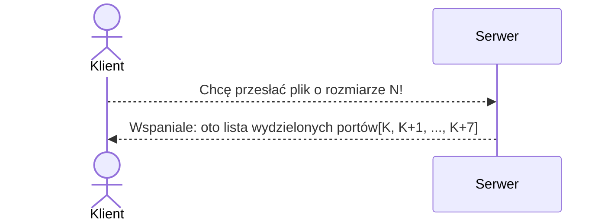
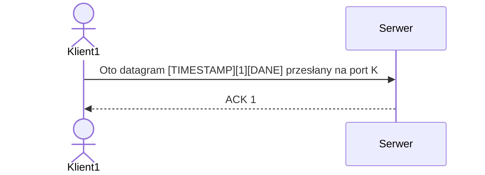

<!-- Nagłówek – nazwę przedmiotu, nazwę projektu (proszę zaproponować jego nazwę własną), nazwiska autorów, wskazanie lidera, datę sporządzenia. -->

# Programowanie Sieciowe

Zespół Z43:
```s
Mateusz Brzozowski
Bartłomiej Krawczyk
Jakub Marcowski
Aleksandra Sypuła # lider
```

# System niezawodnego strumieniowania danych po UDP.

<!-- Treść zadania. -->
Zaprojektuj i zaimplementuj protokół warstwy sesji, umożliwiający równoległe przesyłanie do 8 jednokierunkowych strumieni paczek danych stemplowanych czasem. Należy użyć protokołu UDP. Można użyć implementacji protokołu TFTP (Trivial File Transfer Protocol).

# Założenia co do treści zadania
- klient ma do wysłania określoną liczbę danych, która jest gotowa do wysłania
- należy dane podzielić na 8 kanałów i wysyłać równolegle
- wykorzystujemy UDP
- dodajemy header-y:
    - znacznik czasu
    - id - znacznik fragmentu pliku [0-7]
    - suma kontrolna danych
- serwer wysyła potwierdzenia otrzymania danych o danym znaczniku fragmentu

<!-- Przyjęte założenia funkcjonalne i niefunkcjonalne. -->

## Założenia funkcjonalne:
- niezawodność - wszystkie wysłane dane dotrą w poprawnej formie
- kolejność - wszystkie dane zostaną posortowane po znaczniku czasowym i po id fragmentu

## Założenia niefunkcjonalne:
- brak bezpieczeństwa
- dostępność
- wydajność xD

<!-- Podstawowe przypadki użycia. -->

# Przypadki użycia

- Przesyłanie dużych plików

# Sytuacje






<!-- Analiza możliwych sytuacji błędnych i proponowana ich obsługa. -->

# Możliwe sytuacje błędne

- nawiązywanie połączenia
- TFTP do przesyłania w ramach 1 fragmentu pliku


<!-- Wybrane środowisko sprzętowo-programowe (systemy operacyjne, biblioteki programistyczne) i narzędziowe (debugowanie, testowanie). -->

# Środowisko
- Linux
- python

<!-- Architekturę rozwiązania, tj. ilustrację i opis struktury logicznej systemu (koncepcyjnych bloków funkcjonalnych). Przykładowo oprogramowanie węzła komunikacyjnego można zdekomponować na następujące bloki: -->

<!-- Odbiorca i parser komunikatów, analizujący ich poprawność składniową, sensowność w danym kontekście, wykrywający potencjalne złośliwe komunikaty. -->

<!-- Nadawca komunikatów, sprawdzający poprawność danych otrzymanych do wysłania, obsługujący błędy wysyłania. -->

<!-- Zarządca sesji lub połączenia. Ten blok nie zawsze jest potrzebny. -->

<!-- Rejestrator danych albo zarządca pamięci. Może to być obsługa lokalnej bazy danych. -->

<!-- Interfejs do lokalnej aplikacji na rzecz której prowadzona jest komunikacja. -->

<!-- Obsługa dziennika zdarzeń. -->

<!-- Tester. Moduł działający w tle lub na żądanie sprawdzający spójność przechowywanych danych, poprawność logiczną wykonywanych operacji. -->

<!-- Ewentualnie API modułów stanowiących główne bloki funkcjonalne. -->

```py
class Client:
    def send_to(file: bytes, host: str, port: int) -> None: pass

class Server:
    def receive() -> bytes: pass
```

<!-- Ewentualnie listy komunikatów z określeniem nadawców i odbiorców. -->

<!-- Sposób testowania. -->

# Sposób testowania

- manualny

<!-- Podział prac w zespole. -->

# Podział prac

<!-- Przewidywane funkcje do zademonstrowania w ramach odbioru częściowego. -->

# Funkcje do zademonstrowania
- bezstratny przesył danych
